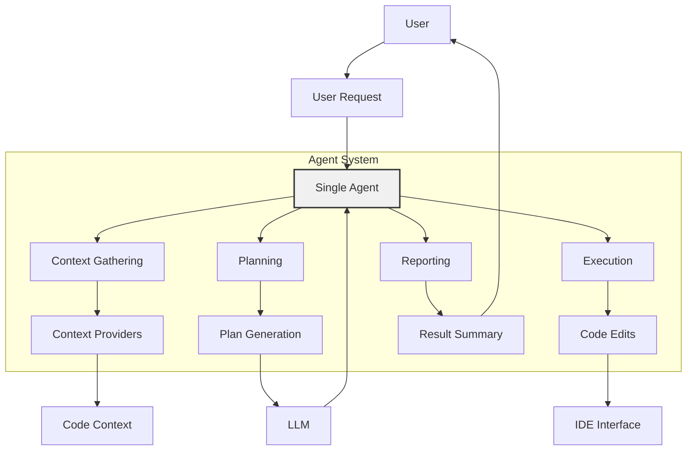
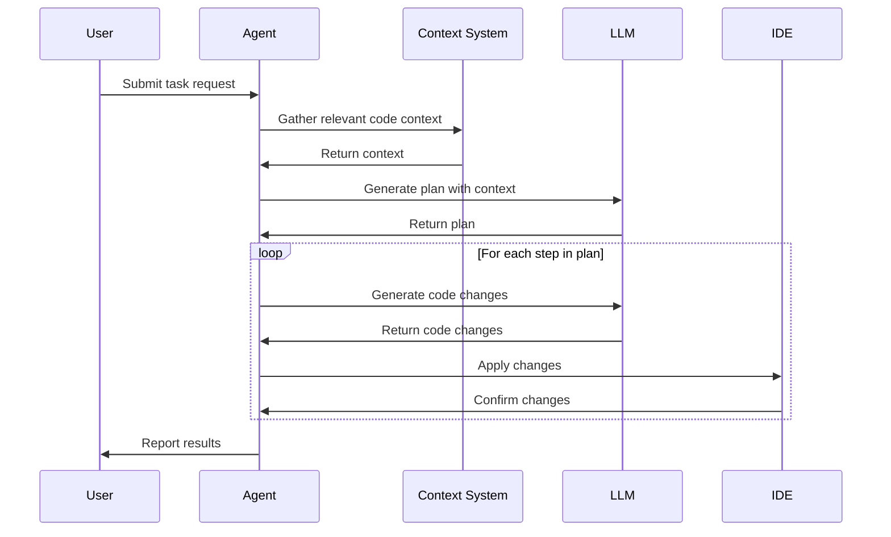
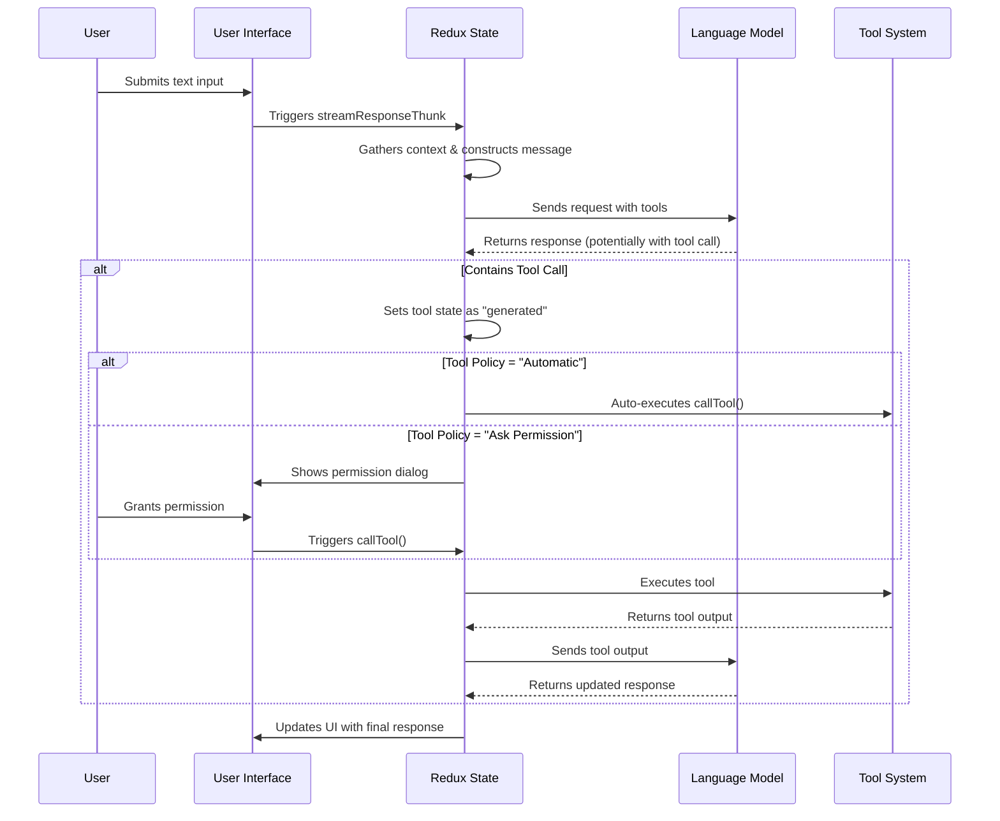
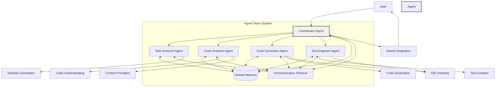
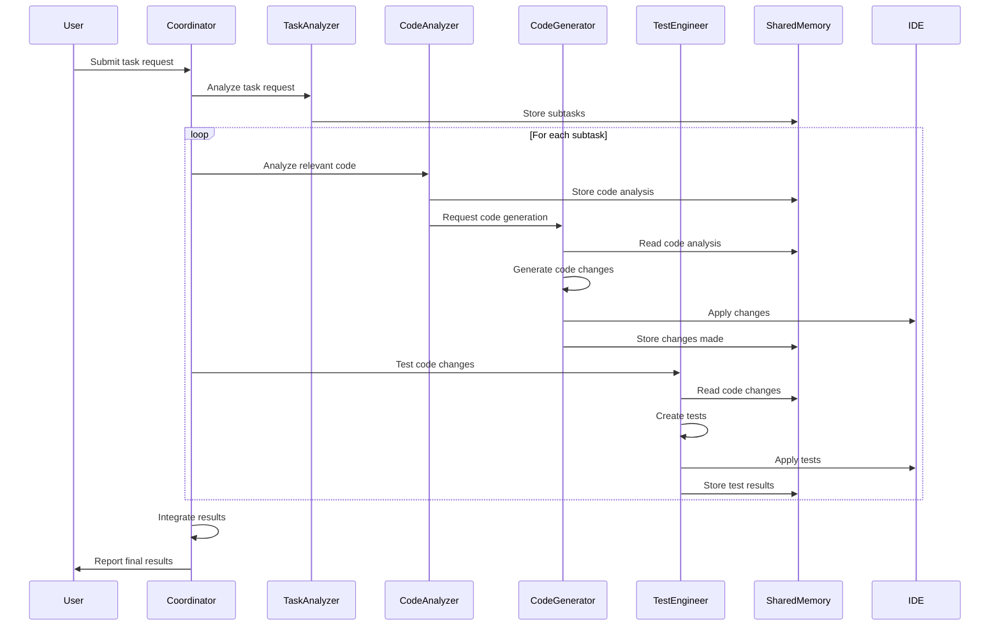

_[← Back to Documentation Navigation](../navigation.md)_

# Agent System

**Navigation:**
- [Index](../index.md)
- [Table of Contents](../table-of-contents.md)
- [Architecture Overview](overview.md)
- [Context System](context-system.md)
- [LLM Integration](llm-integration.md)
- **You are here:** Agent System
- [IDE Integration](ide-integration.md)
- [MCP System](mcp-system.md)

This document explores the agent system in the Continue extension and outlines how it can be evolved into a team-based agent architecture.

## Technology Stack and Implementation

The agent in Continue is built as a custom implementation that directly integrates with language models - it does not use frameworks like LangChain. This design choice provides more control and flexibility in the agent's capabilities.

### Core Technologies
- **Frontend**: React components with TypeScript
- **State Management**: Redux with Redux Toolkit (createAsyncThunk for async operations)
- **Tool System**: Custom-built tool definitions and execution pipeline
- **LLM Integration**: Direct API connections to supported language models

### Key Implementation Details
- Agent mode is implemented through the `selectUseTools` selector which determines when tools should be included in LLM requests
- Tools are defined with JSON Schema for parameters and display properties
- Redux thunks manage the async workflow from user input to tool execution and response
- Tool policies (Ask Permission, Automatic, Disabled) provide user control over tool usage

The agent is structured in layers:
1. User Interface (TipTap Editor, Tool Call Display)
2. State Management (Redux slices)
3. Business Logic (Thunks and tool handling)
4. Service Layer (IDE Messenger, Core module, LLM APIs)

This layered architecture provides a clean separation of concerns and makes the system extensible for future enhancements.

### General Workflow
When a user interacts with the agent, the following workflow occurs:
1. **Input Capture**: The user input is captured through the TipTap rich text editor
2. **Request Processing**: Input is processed via Redux thunks (streamResponseThunk)
3. **Context Collection**: Relevant context about the codebase is gathered
4. **LLM Request**: Message is sent to the language model with available tools
5. **Tool Call Handling**: If the LLM requests a tool, it's handled based on policy:
   - Tool call is automatically executed if policy is "Automatic"
   - User is prompted for permission if policy is "Ask Permission"
   - Tool call is rejected if policy is "Disabled"
6. **Tool Execution**: Approved tools execute and return results to the LLM
7. **Response Generation**: The LLM uses tool results to continue generating responses
8. **Process Continuation**: Steps 4-7 repeat until a final response is provided

### Tool Implementation
Each tool in the agent system consists of:
- **Function Definition**: Core functionality that executes the tool's purpose
- **Parameters Schema**: JSON Schema defining the required inputs
- **Display Properties**: UI elements for rendering the tool call
- **Permission Model**: Controls how tool execution is approved
- **Result Handling**: Processing of outputs for LLM consumption

The tool system is extensible, allowing new tools to be added without changing the core architecture. This facilitates support for different language models with tool-calling capabilities and enables specialized functionality like code editing, file management, and external API access.

### Custom Components and Implementation Details

#### State Management Implementation
The agent's state is primarily managed through several Redux slices:

```typescript
// Key Redux slices
const sessionSlice = createSlice({
  name: "session",
  initialState: {
    history: [],
    mode: "chat", // "chat" or "agent"
    activeTool: null,
    // ...
  },
  reducers: {
    // Various reducers for updating state
  }
});

const configSlice = createSlice({
  name: "config",
  initialState: {
    config: {
      tools: [], // Available tools
      toolSettings: {}, // Settings for each tool
      toolGroupSettings: {} // Settings for tool groups
    }
  },
  // ...
});

const uiSlice = createSlice({
  name: "ui",
  initialState: {
    toolPermissionDialog: {
      visible: false,
      toolCall: null
    }
  },
  // ...
});
```

#### Redux Thunks for Async Operations
The agent uses Redux thunks extensively to handle asynchronous operations:

```typescript
// Main thunks in the agent system
export const streamResponseThunk = createAsyncThunk(/* ... */);
export const streamNormalInput = createAsyncThunk(/* ... */);
export const callTool = createAsyncThunk(/* ... */);
export const streamResponseAfterToolCall = createAsyncThunk(/* ... */);
```

These thunks are responsible for:
- Processing user input
- Streaming responses from the LLM
- Handling tool calls
- Continuing the conversation after tool execution

#### Tool Call UI Components
Special UI components handle the display of tool calls and their results:

```typescript
// Components for tool call display
const ToolCallComponent = ({ toolCall, status }) => {
  // Render tool call details
  return (
    <div className="tool-call">
      <div className="tool-call-header">
        <span className="tool-name">{toolCall.function.name}</span>
        <span className="tool-status">{status}</span>
      </div>
      <div className="tool-call-arguments">
        {/* Render arguments */}
      </div>
    </div>
  );
};

const ToolResultComponent = ({ result }) => {
  // Render tool execution results
  return (
    <div className="tool-result">
      {/* Render result content */}
    </div>
  );
};
```

#### Permission Dialog Implementation
For tools that require user permission, a dialog is shown:

```typescript
// Permission dialog component
const PermissionDialog = ({ toolCall, onApprove, onDeny }) => {
  // Display details about the tool call and request permission
  return (
    <Dialog open={true}>
      <DialogTitle>Tool Permission Required</DialogTitle>
      <DialogContent>
        <div>
          <p>The agent wants to call: {toolCall.function.name}</p>
          <pre>{JSON.stringify(JSON.parse(toolCall.function.arguments), null, 2)}</pre>
        </div>
      </DialogContent>
      <DialogActions>
        <Button onClick={onDeny}>Deny</Button>
        <Button onClick={onApprove}>Approve</Button>
      </DialogActions>
    </Dialog>
  );
};
```

#### Tool Definition Structure
Tools are defined with a consistent structure that includes metadata and execution logic:

```typescript
// Example tool definition
const editFileTool = {
  function: {
    name: "edit_file",
    description: "Edit a file in the workspace",
    parameters: {
      type: "object",
      properties: {
        path: {
          type: "string",
          description: "Path to the file"
        },
        content: {
          type: "string", 
          description: "New content for the file"
        }
      },
      required: ["path", "content"]
    }
  },
  display: {
    icon: "✏️",
    group: "code_editing"
  },
  execution: async (params, context) => {
    // Implementation of file editing logic
    const { path, content } = params;
    await context.ide.writeFile(path, content);
    return {
      result: `File ${path} updated successfully`
    };
  }
};
```

#### Tool Call Execution Flow
The detailed execution flow when a tool is called:

1. The Redux store updates the tool call's state to "calling"
2. The thunk dispatches a request to the IDE messenger
3. The IDE messenger routes the request to the core module
4. The core module locates the appropriate tool implementation
5. The tool function executes with provided parameters
6. Results are captured and formatted as context items
7. Context items are returned to the thunk
8. The thunk updates the Redux store with results
9. A tool result message is added to the conversation
10. The updated conversation is sent back to the LLM for continuation

```typescript
// Simplified tool execution in core.ts
async function callTool(tool, params, context) {
  try {
    // Pre-execution hooks
    context.onToolExecution?.({ tool, params, status: "started" });
    
    // Execute the tool
    const result = await tool.execution(params, context);
    
    // Format result as context items
    const contextItems = formatResult(result);
    
    // Post-execution hooks
    context.onToolExecution?.({ tool, params, status: "completed", result });
    
    return contextItems;
  } catch (error) {
    // Error handling
    context.onToolExecution?.({ tool, params, status: "error", error });
    throw error;
  }
}
```

#### Integration with IDE and LLM APIs
The agent integrates with both the IDE and LLM through abstraction layers:

```typescript
// IDE Messenger interface
interface IDEMessenger {
  request(method: string, data: any): Promise<any>;
  llmStreamChat(options: ChatOptions, signal?: AbortSignal): AsyncGenerator<string>;
  // ...
}

// LLM API interface
interface LLMService {
  streamChat(options: ChatOptions): AsyncGenerator<ChatResponse>;
  // ...
}
```

#### Message Processing Pipeline
Messages go through multiple transformation stages:

1. **User Input Parsing**: Convert rich text to plain text and extract context items
2. **Context Gathering**: Add relevant code snippets and contextual information
3. **History Construction**: Add the processed message to the conversation history
4. **Message Formatting**: Format the history for the LLM, including tools if in agent mode
5. **LLM Request**: Send the formatted messages to the LLM
6. **Response Processing**: Process chunked responses from the LLM
7. **Tool Call Detection**: Detect and extract tool calls from the response
8. **Content Rendering**: Render the response in the UI, including tool calls

#### Context Provider System
The agent leverages context providers to gather relevant information:

```typescript
// Context provider interface
interface ContextProvider {
  getContext(query: string, options: ContextOptions): Promise<ContextItem[]>;
}

// Example context providers:
- FileSystemProvider: Searches for relevant files
- OpenTabsProvider: Gets content from open editor tabs
- CodeSearchProvider: Searches for relevant code snippets
- GitHistoryProvider: Gets relevant git history
```

These providers help the agent understand the codebase structure and contents, which is essential for generating accurate tool calls and responses.

## Current Agent Implementation

The Continue extension includes an agent feature that allows for making substantial changes to the codebase. The current implementation works as follows:

### Current Agent Architecture



### Agent Workflow



1. User initiates an agent task with a natural language request
2. The agent gathers context about the codebase
3. The agent generates a plan to accomplish the task
4. The agent executes the plan, making edits to the codebase
5. The agent reports the results back to the user

### Key Components

The agent system leverages several core components of the Continue extension:

- **Context System**: Provides the agent with relevant code from the codebase
- **LLM Integration**: Powers the agent's reasoning and code generation
- **IDE Integration**: Enables the agent to make changes to files in the editor

### Model Context Protocol (MCP)

The agent can leverage the Model Context Protocol (MCP) to:
- Access specialized tools
- Use standardized prompts
- Interact with external systems

## Agent Text Processing Flow

When a user submits text in Agent Mode, the system processes it through a series of steps to handle the request, potentially execute tools, and generate a response.

### Agent Mode Component Architecture

The Agent Mode system consists of several interconnected components organized in layers:

```
┌─────────────────────────────────────────────────────────┐
│                      User Interface                      │
│  ┌─────────────┐  ┌──────────────┐  ┌────────────────┐  │
│  │ TipTap      │  │ Tool Call    │  │ Permission     │  │
│  │ Editor      │  │ Display      │  │ Dialog         │  │
│  └─────────────┘  └──────────────┘  └────────────────┘  │
└───────────────────────────┬─────────────────────────────┘
                            │
                            ▼
┌─────────────────────────────────────────────────────────┐
│                    Redux State Layer                     │
│  ┌─────────────┐  ┌──────────────┐  ┌────────────────┐  │
│  │ Session     │  │ UI           │  │ Config         │  │
│  │ Slice       │  │ Slice        │  │ Slice          │  │
│  └─────────────┘  └──────────────┘  └────────────────┘  │
└───────────────────────────┬─────────────────────────────┘
                            │
                            ▼
┌─────────────────────────────────────────────────────────┐
│                   Business Logic Layer                   │
│  ┌─────────────┐  ┌──────────────┐  ┌────────────────┐  │
│  │ Thunks      │  │ Selectors    │  │ Tool Call      │  │
│  │             │  │              │  │ Handling       │  │
│  └─────────────┘  └──────────────┘  └────────────────┘  │
└───────────────────────────┬─────────────────────────────┘
                            │
                            ▼
┌─────────────────────────────────────────────────────────┐
│                      Service Layer                       │
│  ┌─────────────┐  ┌──────────────┐  ┌────────────────┐  │
│  │ IDE         │  │ Core         │  │ Language       │  │
│  │ Messenger   │  │ Module       │  │ Model API      │  │
│  └─────────────┘  └──────────────┘  └────────────────┘  │
└─────────────────────────────────────────────────────────┘
```

### Data Flow Sequence

The detailed sequence of how text input is processed in Agent Mode:



### Detailed Steps in Text Processing

#### 1. Text Input Submission

When a user submits text in the Agent Mode:

```typescript
// In TipTapEditor.tsx
onEnter={onEnterRef.current}
```

The `onEnter` callback is connected to the `sendInput` function in `Chat.tsx`:

```typescript
// In Chat.tsx
const sendInput = useCallback(
  (
    editorState: JSONContent,
    modifiers: InputModifiers,
    index?: number,
    editorToClearOnSend?: Editor,
  ) => {
    // ...
    dispatch(
      streamResponseThunk({ editorState, modifiers, promptPreamble, index }),
    );
    // ...
  },
  [/* dependencies */]
);
```

The editorState contains the rich text content from the TipTap editor, which can include regular text, code blocks, @mentions for context items, and other rich content.

#### 2. Message Processing

The submitted text is processed through the Redux thunk system:

```typescript
// In streamResponse.ts
export const streamResponseThunk = createAsyncThunk<
  void,
  {
    editorState: JSONContent;
    modifiers: InputModifiers;
    index?: number;
    promptPreamble?: string;
  },
  ThunkApiType
>(
  "chat/streamResponse",
  async (
    { editorState, modifiers, index, promptPreamble },
    { dispatch, extra, getState },
  ) => {
    // Process user input, gather context, and prepare messages
    // ...
    
    // Call streamNormalInput to send the request to the LLM
    unwrapResult(
      await dispatch(
        streamNormalInput({
          messages,
          legacySlashCommandData: /* ... */,
        }),
      ),
    );
  }
);
```

During this process, the following operations occur:
1. The editorState is converted into plain text and context items
2. Additional context is gathered based on the modifiers
3. The session history is updated with the new user message
4. Messages are constructed from the updated history for the LLM request

#### 3. Agent Mode Detection

The system uses a selector in the Session slice to determine if Agent Mode is active:

```typescript
// In sessionSlice.ts
selectUseTools: (state) => {
  return state.mode === "agent";
},
```

When in Agent Mode, the system includes tools in the request to the LLM:

```typescript
// In streamNormalInput.ts
const useTools = selectUseTools(state);
const includeTools = useTools && modelSupportsTools(selectedChatModel);

// Send request with tools if in Agent Mode
const gen = extra.ideMessenger.llmStreamChat(
  {
    completionOptions: includeTools
      ? {
          tools: state.config.config.tools.filter(
            (tool) =>
              toolSettings[tool.function.name] !== "disabled" &&
              toolGroupSettings[tool.group] !== "exclude",
          ),
        }
      : {},
    // ...
  },
  streamAborter.signal,
);
```

This is a critical part of the agent flow - if Agent Mode is active, the available tools are filtered based on user preferences and included in the request to the LLM.

#### 4. Tool Call Handling

When the LLM response includes a tool call, the system processes it according to the configured tool policy:

```typescript
// In streamNormalInput.ts
// If it's a tool call that is automatically accepted, we should call it
const toolCallState = selectCurrentToolCall(getState());
if (toolCallState) {
  dispatch(setToolGenerated());

  if (
    toolSettings[toolCallState.toolCall.function.name] ===
    "allowedWithoutPermission"
  ) {
    const response = await dispatch(callTool());
    unwrapResult(response);
  }
}
```

If the tool is not set to automatic execution, the UI displays a permission dialog to the user.

#### 5. Tool Execution

When a tool call is approved (either automatically or by the user), it's executed through the `callTool` thunk:

```typescript
// In callTool.ts
export const callTool = createAsyncThunk<void, undefined, ThunkApiType>(
  "chat/callTool",
  async (_, { dispatch, extra, getState }) => {
    // ...
    dispatch(setCalling());
    
    // Execute the tool call
    const result = await extra.ideMessenger.request("tools/call", {
      toolCall: toolCallState.toolCall,
      selectedModelTitle: selectedChatModel.title,
    });
    
    // Process result
    // ...
  }
);
```

The actual tool execution happens in the Core component:

```typescript
// In core.ts
on(
  "tools/call",
  async ({ data: { toolCall, selectedModelTitle }, messageId }) => {
    // Find and execute the tool
    const contextItems = await callTool(
      tool,
      JSON.parse(toolCall.function.arguments || "{}"),
      {
        ide: this.ide,
        llm: config.selectedModelByRole.chat,
        fetch: (url, init) =>
          fetchwithRequestOptions(url, init, config.requestOptions),
        tool,
        toolCallId: toolCall.id,
        onPartialOutput,
      },
    );
    
    // Return result
    return { contextItems };
  },
);
```

#### 6. Tool Response Processing

After a tool is executed, its result is processed and sent back to the LLM:

```typescript
// In streamResponseAfterToolCall.ts
export const streamResponseAfterToolCall = createAsyncThunk<
  void,
  {
    toolCallId: string;
    toolOutput: ContextItem[];
  },
  ThunkApiType
>(
  "chat/streamAfterToolCall",
  async ({ toolCallId, toolOutput }, { dispatch, getState }) => {
    // Add tool output as context
    const newMessage: ChatMessage = {
      role: "tool",
      content: renderContextItems(toolOutput),
      toolCallId,
    };
    dispatch(streamUpdate([newMessage]));
    
    // Send updated context back to LLM
    const messages = constructMessages(/* ... */);
    unwrapResult(await dispatch(streamNormalInput({ messages })));
  }
);
```

This creates a continuous loop where:
1. The LLM can request a tool be called
2. The tool executes and returns results
3. The results are sent back to the LLM
4. The LLM can make another decision based on the results

### Tool Call States

Tool calls can be in various states during their lifecycle:

| State | Description |
|-------|-------------|
| `generating` | The LLM is generating a tool call |
| `generated` | Tool call is complete, waiting for permission |
| `calling` | The tool is being executed |
| `done` | The tool execution has completed |
| `canceled` | The user denied permission for execution |

The state transitions are managed in the session slice:

```typescript
// In sessionSlice.ts
setCalling: (state) => {
  const toolCallState = findCurrentToolCall(state.history);
  if (!toolCallState) return;

  toolCallState.status = "calling";
},
acceptToolCall: (state) => {
  state.activeToolStreamId = undefined;
  const toolCallState = findCurrentToolCall(state.history);
  if (!toolCallState) return;

  toolCallState.status = "done";
},
cancelToolCall: (state) => {
  const toolCallState = findCurrentToolCall(state.history);
  if (!toolCallState) return;

  toolCallState.status = "canceled";
},
```

### Tool Call State Diagram

```
┌─────────────┐
│             │
│ generating  │
│             │
└──────┬──────┘
       │
       ▼
┌─────────────┐
│             │
│  generated  │◄─────────┐
│             │          │
└──────┬──────┘          │
       │                 │
       │                 │
       ▼                 │
┌─────────────┐    ┌─────────────┐
│             │    │             │
│   calling   │    │  canceled   │
│             │    │             │
└──────┬──────┘    └─────────────┘
       │                 ▲
       │                 │
       ▼                 │
┌─────────────┐          │
│             │          │
│    done     │          │
│             │          │
└─────────────┘          │
       │                 │
       │                 │
       ▼                 │
┌─────────────┐          │
│  New Tool   │          │
│  Call       ├──────────┘
│             │
└─────────────┘
```

### Tool Policies

Agent Mode supports three policies for tool execution:

1. **Ask Permission (default)**: The user must approve each tool call
2. **Automatic**: Tools execute without requiring user permission
3. **Disabled**: The tool cannot be used by the agent

These policies can be configured per tool or per tool group in the user settings.

## Limitations of Current Implementation

The current agent system has several limitations:

1. **Single Agent**: Tasks are handled by a single agent, limiting the complexity of tasks that can be accomplished
2. **Limited Specialization**: The agent is a generalist without specialized capabilities
3. **Limited Collaboration**: There's no mechanism for multiple agents to collaborate on a task
4. **Fixed Execution Flow**: The agent follows a predetermined workflow without dynamic adjustment

## Evolving to Team-Based Agents

To achieve our goal of sending work to a team of agents, we need to evolve the current system in several ways:

### Proposed Team-Based Architecture



### Team-Based Workflow



### 1. Agent Team Architecture

Create a multi-agent architecture where different agents have specialized roles:

- **Task Analyzer**: Analyzes the user request and breaks it down into subtasks
- **Code Analyzer**: Specializes in understanding existing code and its architecture
- **Code Generator**: Focuses on generating high-quality code for specific requirements
- **Test Engineer**: Creates and runs tests for the generated code
- **Coordinator**: Manages the workflow between agents and aggregates results

### 2. Communication Protocol

Implement a communication protocol between agents:

- Define message formats for inter-agent communication
- Establish a shared memory for agents to exchange information
- Create a mechanism for agents to request help from other agents

### 3. Task Distribution System

Create a system to distribute tasks among agents:

- Break down complex tasks into smaller, manageable subtasks
- Assign subtasks to appropriate specialized agents
- Track progress and dependencies between subtasks

### 4. Collaborative Context Management

Enhance the context system to support collaborative work:

- Allow agents to share relevant context with each other
- Maintain a shared understanding of the codebase
- Track changes made by different agents

### 5. Result Aggregation

Implement mechanisms to aggregate the results of multiple agents:

- Combine code changes from different agents
- Resolve conflicts between agent contributions
- Generate comprehensive reports of the work done

## Implementation Strategy

To evolve the current agent system into a team-based architecture, we should:

1. **Create Agent Framework**: Develop a framework for defining specialized agents with different capabilities
2. **Implement Communication Infrastructure**: Build the communication channels between agents
3. **Enhance Context Sharing**: Modify the context system to support shared context between agents
4. **Develop Task Management**: Create a system to break down and distribute tasks
5. **Build Result Integration**: Implement mechanisms to combine the work of multiple agents

## Key Files to Modify

To implement this evolution, we'll need to modify or create the following components:

- Create a new agent team coordinator in `core/agent/team/`
- Extend the current agent implementation to support specialized roles
- Implement a communication protocol between agents
- Enhance the context system to support collaborative work
- Modify the user interface to show the work of multiple agents

## Conclusion

Evolving the Continue extension's agent system into a team-based architecture will enable more complex and high-quality code generation. By creating specialized agents that collaborate on tasks, we can address the limitations of the current single-agent approach and build a more powerful tool for developers.

---

**Navigation:**
- [Index](../index.md)
- [Table of Contents](../table-of-contents.md)
- [Architecture Overview](overview.md)
- [Context System](context-system.md)
- [LLM Integration](llm-integration.md)
- **You are here:** Agent System
- [IDE Integration](ide-integration.md)
- [MCP System](mcp-system.md) 