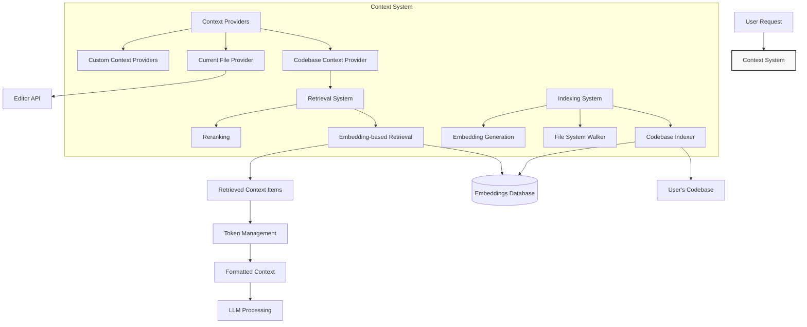
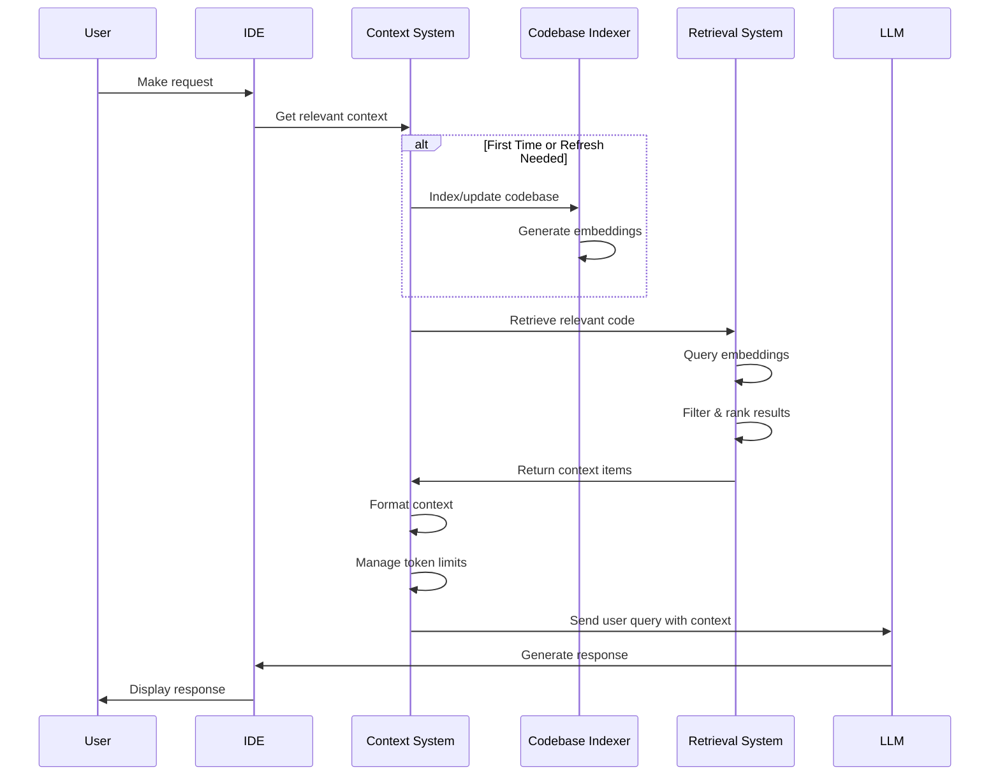

# Context System

**Navigation:**
- [Index](../index.md)
- [Table of Contents](../table-of-contents.md)
- [Architecture Overview](overview.md)
- **You are here:** Context System
- [LLM Integration](llm-integration.md)
- [Agent System](agent-system.md)
- [IDE Integration](ide-integration.md)
- [MCP System](mcp-system.md)

The Context System is a key component of the Continue extension that enables AI models to understand and work with the user's codebase. This document explains how the system collects, processes, and provides relevant code context to AI models.

## Overview

The Context System is responsible for gathering relevant information from the codebase to provide as context to the LLM. This context helps the AI model generate more accurate and relevant responses, as it has access to the code the user is working with.

## System Architecture

## Key Components

### 1. Context Providers

Context providers are modular components that gather different types of context:

- `CodebaseContextProvider`: Retrieves relevant files from the codebase using semantic search
- `CurrentFileContextProvider`: Provides context from the currently open file
- Custom context providers can be registered by extensions

Context providers are defined in `core/context/providers/`.

### 2. Retrieval System

The retrieval system is responsible for finding relevant code in the codebase:

- Uses embeddings for semantic search
- Supports different retrieval pipelines (with or without reranking)
- Filters and ranks results based on relevance

The main retrieval functionality is in `core/context/retrieval/retrieval.ts`.

### 3. Indexing

For efficient context retrieval, the codebase is indexed:

- `CodebaseIndexer` (defined in `core/indexing/CodebaseIndexer.ts`) manages the indexing process
- The indexer creates and maintains embeddings of code files
- Indexing happens in the background and updates when files change

## Context Flow

1. **Gathering**: When a user interacts with the AI, context providers are invoked to gather relevant context
2. **Processing**: The gathered context is processed, filtered, and limited to fit within token constraints
3. **Inclusion**: The processed context is included with the user's query when sent to the LLM
4. **Response**: The LLM generates a response based on the user's query and the provided context

## Retrieval Process

The retrieval process in `retrieveContextItemsFromEmbeddings` function works as follows:

1. Determine the workspace directories and current branch
2. Calculate how many code snippets to retrieve based on the LLM's context length
3. Create a retrieval pipeline (with or without reranking)
4. Execute the pipeline to find relevant code snippets
5. Format the retrieved code as context items
6. Add instructions to guide the LLM on how to use the provided code

## Model Context Protocol (MCP) Integration

The Context System also integrates with the Model Context Protocol (MCP) through:

- `MCPManagerSingleton`: Manages connections to MCP servers
- MCP connections can provide additional context and tools to the LLM

## Challenges and Considerations

- **Token Limitations**: The context system must balance providing enough context while staying within token limits
- **Relevance**: Finding the most relevant code snippets is crucial for helpful AI responses
- **Performance**: Indexing and retrieval must be efficient to maintain a good user experience

Understanding this context system is essential for evolving the extension into an agent-based system, as agents will rely on this context to understand the codebase they are working with.

---

**Navigation:**
- [Index](../index.md)
- [Table of Contents](../table-of-contents.md)
- [Architecture Overview](overview.md)
- **You are here:** Context System
- [LLM Integration](llm-integration.md)
- [Agent System](agent-system.md)
- [IDE Integration](ide-integration.md)
- [MCP System](mcp-system.md) 