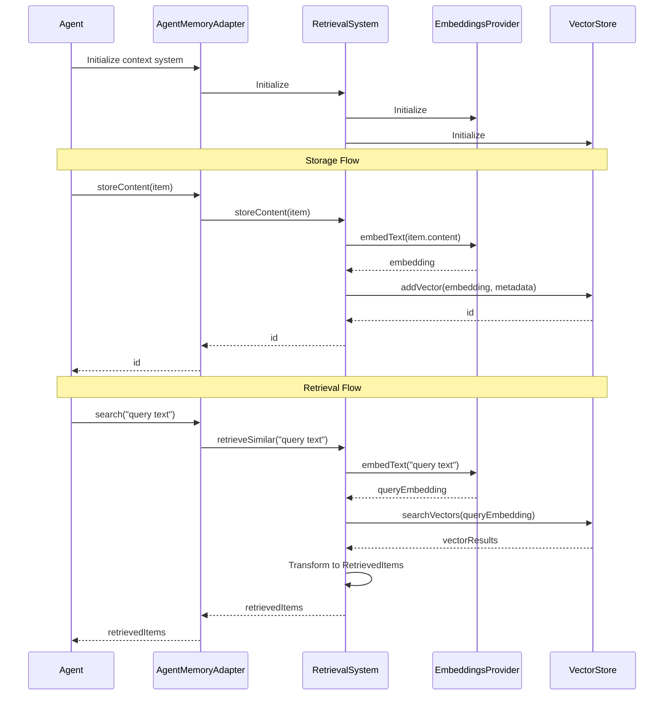
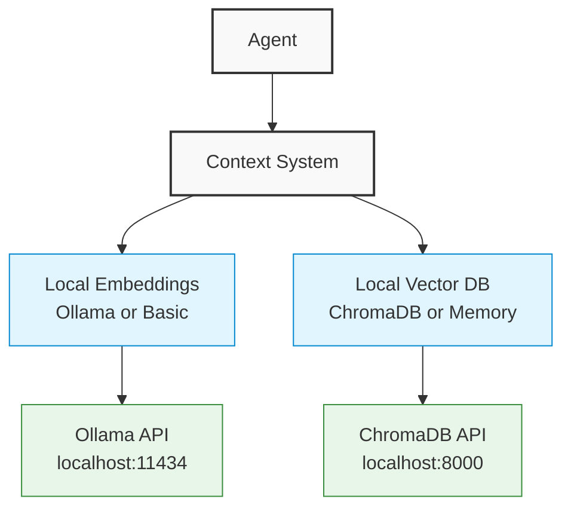

_[← Back to Documentation Navigation](../navigation.md)_

# Context System

**Navigation:**

- [Index](../index.md)
- [Table of Contents](../table-of-contents.md)
- [Architecture Overview](overview.md)
- **You are here:** Context System
- [LLM Integration](llm-integration.md)
- [Agent System](agent-system.md)
- [IDE Integration](ide-integration.md)
- [MCP System](mcp-system.md)
- **Technology Documentation:**
  - [Vector Databases](../technologies/vector-databases.md)
  - [Agent Frameworks](../technologies/agent-frameworks.md)
  - [Embedding Providers](../technologies/embedding-providers.md)
  - [LLM Providers](../technologies/llm-providers.md)

## Simple Explanation

### What is the Context System?

The Context System is like a smart memory for our AI agents. It helps them find and remember information based on meaning rather than exact matches. Here's how it works in plain terms:

1. **Text to Numbers**: When the system reads text (code, documentation, messages), it converts it into special number patterns (vectors) that capture meaning.

2. **Smart Storage**: These number patterns are stored in a way that makes similar concepts stay close to each other.

3. **Meaning-Based Search**: When an agent needs information, it can ask "what's related to X?" and get results based on meaning, not just keywords.

4. **Memory Organization**: Information can be grouped into contexts (like "current task" or "code review") for better organization.

### Why Did We Build It This Way?

- **Efficiency**: Agents need to quickly find relevant information without searching through everything.
- **Understanding**: Traditional keyword search misses related concepts that use different words.
- **Integration**: The system connects with our agent memory for a complete knowledge base.
- **Flexibility**: It works with both simple in-memory storage for development and can be upgraded to advanced vector databases for production.

### Real-World Analogy

Think of the Context System as a librarian with photographic memory who understands concepts. You can ask "Do we have anything about making code faster?" and they'll point you to resources about optimization, performance, and efficiency—even if those exact words weren't in your question.

## Technical Architecture

```mermaid
graph TD
    subgraph "Context System"
        CS["Context System<br>entry point"] --> EmbSys["Embeddings System"]
        CS --> VecStore["Vector Storage"]
        CS --> RetSys["Retrieval System"]
        CS --> Adapter["Agent Memory Adapter"]

        EmbSys --> EmbProvider["Embeddings Provider<br>Interface"]
        EmbSys --> BasicEmb["Basic Embeddings<br>Provider"]
        EmbSys --> EmbQueue["Embedding Queue"]

        VecStore --> VStoreInterface["Vector Store<br>Interface"]
        VecStore --> MemVStore["Memory Vector<br>Store"]

        RetSys --> RetInterface["Retrieval System<br>Interface"]
        RetSys --> BasicRet["Basic Retrieval<br>System"]

        Adapter --> ContextBlocks["Context Blocks<br>Management"]
        Adapter --> SemanticSearch["Semantic Search"]
        Adapter --> MemoryIndex["Memory Indexing"]
    end

    subgraph "Integration Points"
        AgentMem["Agent Memory<br>System"] <--> Adapter
        LLMs["LLM Interactions"] --> RetSys
    end

    style CS fill:#4da6ff,stroke:#0066cc,color:white
    style EmbSys fill:#80bfff,stroke:#4da6ff
    style VecStore fill:#80bfff,stroke:#4da6ff
    style RetSys fill:#80bfff,stroke:#4da6ff
    style Adapter fill:#80bfff,stroke:#4da6ff

    style EmbProvider fill:#cce6ff,stroke:#80bfff
    style BasicEmb fill:#cce6ff,stroke:#80bfff
    style EmbQueue fill:#cce6ff,stroke:#80bfff

    style VStoreInterface fill:#cce6ff,stroke:#80bfff
    style MemVStore fill:#cce6ff,stroke:#80bfff

    style RetInterface fill:#cce6ff,stroke:#80bfff
    style BasicRet fill:#cce6ff,stroke:#80bfff

    style ContextBlocks fill:#cce6ff,stroke:#80bfff
    style SemanticSearch fill:#cce6ff,stroke:#80bfff
    style MemoryIndex fill:#cce6ff,stroke:#80bfff

    style AgentMem fill:#f9d77e,stroke:#d9b95c
    style LLMs fill:#f9d77e,stroke:#d9b95c
```



## Components in Detail

### 1. Embeddings System

The Embeddings System converts text into vector representations that capture semantic meaning.

#### Key Components:

- **EmbeddingsProvider Interface**: Defines methods for generating vector embeddings from text

  ```typescript
  interface EmbeddingsProvider {
    getName(): string;
    embedMany(texts: string[]): Promise<number[][]>;
    embedOne(text: string): Promise<number[]>;
    getDimension(): number;
    initialize(): Promise<void>;
    requiresBatching(): boolean;
    getBatchSize(): number;
  }
  ```

- **BasicEmbeddingsProvider**: A simple implementation for development and testing

  - Uses basic text processing with bag-of-words approach
  - Normalizes and tokenizes text
  - Maps tokens to vector dimensions with simple hashing
  - Provides L2 normalization for consistent vector comparison

- **EmbeddingQueue**: Manages efficient processing of embedding requests
  - Batches requests for better performance
  - Handles async processing with controllable concurrency
  - Provides event emitters for monitoring

### 2. Vector Storage

The Vector Storage system stores and retrieves embedding vectors with associated metadata.

#### Key Components:

- **VectorStore Interface**: Defines methods for storing and querying vectors

  ```typescript
  interface VectorStore {
    initialize(): Promise<void>;
    addVector(vector: Vector): Promise<string>;
    addVectors(vectors: Vector[]): Promise<string[]>;
    searchVectors(
      embedding: number[],
      options?: VectorSearchOptions,
    ): Promise<VectorSearchResult[]>;
    getVector(id: string): Promise<Vector | null>;
    deleteVector(id: string): Promise<boolean>;
    deleteVectors(filter: VectorMetadataFilter): Promise<number>;
    getVectorCount(filter?: VectorMetadataFilter): Promise<number>;
  }
  ```

- **MemoryVectorStore**: In-memory implementation for development

  - Implements cosine similarity for semantic matching
  - Provides advanced filtering capabilities
  - Supports metadata-based queries
  - Includes CRUD operations for vectors

- **Vector Types**:
  - `Vector`: Embedding with metadata
  - `VectorMetadata`: Information about the vector content
  - `VectorSearchOptions`: Configuration for search operations
  - `VectorMetadataFilter`: Query parameters for filtering

### 3. Retrieval System

The Retrieval System provides a higher-level API for storing and finding content based on semantic similarity.

#### Key Components:

- **RetrievalSystem Interface**: Content-focused API (rather than embedding-focused)

  ```typescript
  interface RetrievalSystem {
    initialize(): Promise<void>;
    storeContent(item: ContentItem): Promise<string>;
    storeContents(items: ContentItem[]): Promise<string[]>;
    retrieveSimilar(
      query: string,
      options?: RetrievalOptions,
    ): Promise<RetrievedItem[]>;
    deleteContent(id: string): Promise<boolean>;
    deleteContents(filter: VectorMetadataFilter): Promise<number>;
  }
  ```

- **BasicRetrievalSystem**: Implementation connecting embeddings and vector storage

  - Handles embedding generation and storage transparently
  - Provides content-focused interface
  - Transforms between content items and vector representations
  - Implements filtering and result transformation

- **Content Types**:
  - `ContentItem`: Information to be stored and retrieved
  - `RetrievedItem`: Content with similarity score
  - `RetrievalOptions`: Configuration for retrieval operations

### 4. Agent Memory Adapter

The Agent Memory Adapter connects the context system with the agent memory framework.

#### Key Components:

- **AgentMemoryAdapter**: Main integration point with agent memory

  ```typescript
  class AgentMemoryAdapter {
    initialize(): Promise<void>;
    storeContent(
      item: ContentItem,
      storeInAgentMemory?: boolean,
    ): Promise<string>;
    indexAgentMemory(
      memoryType: string,
      contentType: string,
      filter?: Record<string, any>,
    ): Promise<number>;
    search(query: string, options?: RetrievalOptions): Promise<RetrievedItem[]>;
    addContextBlock(
      contextName: string,
      type: string,
      content: string,
      source: string,
      metadata?: Record<string, any>,
    ): Promise<string>;
    searchContext(
      query: string,
      contextNames?: string[],
      options?: RetrievalOptions,
    ): Promise<RetrievedItem[]>;
    getRetrievalSystem(): BasicRetrievalSystem;
    isInitialized(): boolean;
  }
  ```

- **Context Management**: Organizes related information

  - Creates named contexts for grouping information
  - Adds typed content blocks to contexts
  - Provides context-specific search

- **Memory Indexing**: Makes agent memories searchable
  - Converts agent memories to searchable content
  - Preserves metadata and relationships
  - Enables semantic search across memory types

## System Flow



## Usage Examples

### Basic Usage

```typescript
// Create a context system for an agent
const contextSystem = await createContextSystem("agent-id");

// Store content for later retrieval
await contextSystem.storeContent({
  content:
    "TypeScript is a strongly typed programming language that builds on JavaScript.",
  contentType: "documentation",
  source: "typescript-docs",
});

// Search for similar content
const results = await contextSystem.search("static typing in JavaScript");
console.log(results);
// Results include the TypeScript documentation based on semantic similarity
```

### Advanced Usage with Context Blocks

```typescript
// Create a named context for a specific task
await memoryManager.createContext("code-review-task");

// Add content blocks to the context
await contextSystem.addContextBlock(
  "code-review-task",
  "code",
  "function calculateSum(a: number, b: number): number { return a + b; }",
  "example.ts",
  { lineNumbers: "1-3" },
);

await contextSystem.addContextBlock(
  "code-review-task",
  "comment",
  "We need to ensure proper type checking for all function parameters",
  "user",
  { priority: "high" },
);

// Search within the specific context
const contextResults = await contextSystem.searchContext(
  "type checking function parameters",
  ["code-review-task"],
);
```

### Integration with Agent Memory

```typescript
// Index existing agent memories for semantic search
await contextSystem.indexAgentMemory("conversation", "message", {
  important: true,
});

// Query both indexed memories and stored content
const results = await contextSystem.search(
  "previous discussions about performance",
);
```

## Extending the System

### Custom Embeddings Provider

For production use, you can implement a custom embeddings provider that connects to more sophisticated embedding models:

```typescript
class OpenAIEmbeddingsProvider implements EmbeddingsProvider {
  constructor(
    private apiKey: string,
    private model: string = "text-embedding-ada-002",
  ) {}

  getName(): string {
    return "openai-embeddings";
  }

  async initialize(): Promise<void> {
    // Validate API key, etc.
  }

  async embedOne(text: string): Promise<number[]> {
    // Call OpenAI API to get embeddings
    // Transform response to number[]
  }

  // Implement other required methods...
}

// Use the custom provider
const contextSystem = await createContextSystem("agent-id", {
  embeddingsProvider: new OpenAIEmbeddingsProvider(process.env.OPENAI_API_KEY),
});
```

### Custom Vector Store

For scaling to larger datasets, you can implement a custom vector store:

```typescript
class PineconeVectorStore implements VectorStore {
  constructor(
    private apiKey: string,
    private indexName: string,
  ) {}

  async initialize(): Promise<void> {
    // Connect to Pinecone
  }

  async addVector(vector: Vector): Promise<string> {
    // Store vector in Pinecone
  }

  async searchVectors(
    embedding: number[],
    options?: VectorSearchOptions,
  ): Promise<VectorSearchResult[]> {
    // Query Pinecone for similar vectors
  }

  // Implement other required methods...
}

// Use the custom vector store
const contextSystem = await createContextSystem("agent-id", {
  vectorStore: new PineconeVectorStore(
    process.env.PINECONE_API_KEY,
    "aigents-index",
  ),
});
```

## Design Decisions

### In-Memory vs. External Storage

- **Development Phase**: The current implementation uses in-memory storage for simplicity during development
- **Production Readiness**: The interfaces are designed to allow easy swapping of components for production needs
- **Extensibility**: Custom implementations can connect to services like Pinecone, Chroma, or Qdrant

### Basic Embeddings Provider

- **Development Convenience**: Provides a fallback that works without external dependencies
- **Production Note**: Not intended for production use - should be replaced with a proper embedding model
- **Trade-offs**: Sacrifices quality for independence from external services during development

### Integration with Agent Memory

- **Dual Storage**: Content can be stored in both the vector store and agent memory
- **Selective Indexing**: Agent memories can be selectively indexed for semantic search
- **Context Management**: Provides organization through named contexts and typed blocks

### Vector Database Implementation Options

#### Development Phase: MemoryVectorStore

The current `MemoryVectorStore` implementation provides:

- Simple in-memory storage for embeddings
- No external dependencies
- Fast development and testing

However, this approach has clear limitations:

- Data is lost when the application restarts
- Limited to memory capacity
- Less efficient for large-scale similarity search

#### Short-term Plan: Local Vector Database Integration

For a more robust solution that maintains our offline-first approach, we'll implement a local vector database integration. ChromaDB is particularly well-suited for our needs:

- **Fully local operation**: Can run entirely on the user's machine without internet access
- **Persistent storage**: Maintains embeddings between application restarts
- **Project isolation**: Can create separate collections for different projects
- **JavaScript API**: Native TypeScript/JavaScript support
- **Docker option**: Can run in a Docker container if needed

```typescript
// Planned implementation
import { ChromaClient, Collection } from "chromadb";

class ChromaVectorStore implements VectorStore {
  private client: ChromaClient;
  private collection: Collection;

  constructor(projectId: string) {
    // Connect to local ChromaDB instance
    this.client = new ChromaClient({
      path: "http://localhost:8000", // Local ChromaDB server
    });
    this.projectId = projectId;
  }

  async initialize(): Promise<void> {
    // Create a collection specific to this project
    // This ensures isolation between different projects
    this.collection = await this.client.getOrCreateCollection({
      name: `aigents-${this.projectId}`,
      metadata: {
        projectId: this.projectId,
        description: "AIgents vector embeddings",
      },
    });
  }

  async addVector(vector: Vector): Promise<string> {
    const id = vector.metadata.id || uuidv4();
    await this.collection.add({
      ids: [id],
      embeddings: [vector.embedding],
      metadatas: [vector.metadata],
    });
    return id;
  }

  async searchVectors(
    embedding: number[],
    options?: VectorSearchOptions,
  ): Promise<VectorSearchResult[]> {
    const { limit = 10, filter } = options || {};

    const results = await this.collection.query({
      queryEmbeddings: [embedding],
      nResults: limit,
      whereDocument: this.transformFilter(filter),
    });

    // Transform results to VectorSearchResult format
    return results.map((result, i) => ({
      vector: {
        embedding: result.embeddings[0],
        metadata: result.metadatas[0],
      },
      score: result.distances[0],
    }));
  }

  // Other required methods...
}
```

##### Alternative Local Vector Database Options

If ChromaDB proves challenging to integrate, we have several other offline-friendly options:

1. **SQLite-based vector databases**:

   - **sqlite-vss**: SQLite extension for vector similarity search
   - **voy**: Lightweight vector similarity search for JavaScript using SQLite

2. **File-based vector databases**:

   - **LanceDB**: Embedded vector database that stores data in Lance format files
   - **FAISS with file persistence**: Meta's FAISS library with custom file storage

3. **Embedded vector stores**:
   - **Qdrant embedded**: In-process vector database with full functionality
   - **Milvus Lite**: Embedded version of Milvus that runs locally

Our selection criteria prioritize:

- Full offline functionality
- Simple installation/startup process
- Support for project isolation
- Low resource requirements
- Native TypeScript/JavaScript support

### Project Isolation Strategy

To ensure multiple projects can coexist without conflicts:

1. **Collection Namespacing**: Each project will have its own collection in the vector database

   ```typescript
   // Example: Creating a project-specific collection
   const collection = await client.getOrCreateCollection({
     name: `aigents-${workspaceId}`,
     metadata: { workspaceId },
   });
   ```

2. **Workspace-aware Storage Paths**:

   ```typescript
   // Example: Configuring storage paths per workspace
   const storageBasePath = path.join(extensionStoragePath, "vector-db");
   const workspacePath = path.join(
     storageBasePath,
     hashWorkspacePath(workspace.uri.fsPath),
   );
   ```

3. **Isolated Agent Memory**:

   ```typescript
   // Example: Creating isolated memory manager instances
   const getMemoryManager = (agentId: string, projectId: string) => {
     return new MemoryManager(agentId, {
       namespace: projectId,
     });
   };
   ```

4. **Resource Management**:
   - Local databases will be initialized on demand when a project is loaded
   - Resources will be released when a project is closed
   - Configuration will limit maximum resource usage per project

### Embedding Model Integration

While our `BasicEmbeddingsProvider` works for development, we'll need more sophisticated embedding models. Focusing on offline capabilities:

1. **Local Embedding Models**:
   - **Ollama with embedding models**: Using Ollama to run embedding models locally
   - **Sentence Transformers**: Running lightweight embedding models directly
   - **LM Studio**: Using LM Studio's embedding capabilities

```typescript
// Example: Ollama embedding provider
class OllamaEmbeddingsProvider implements EmbeddingsProvider {
  constructor(private modelName: string = "nomic-embed-text") {
    this.apiUrl = "http://localhost:11434/api/embeddings";
  }

  async embedOne(text: string): Promise<number[]> {
    const response = await fetch(this.apiUrl, {
      method: "POST",
      headers: { "Content-Type": "application/json" },
      body: JSON.stringify({
        model: this.modelName,
        prompt: text,
      }),
    });

    const data = await response.json();
    return data.embedding;
  }

  // Other methods...
}
```

2. **Optional Cloud Embedding Models** (when offline isn't required):
   - OpenAI Embeddings API
   - Cohere Embed API
   - Azure OpenAI Service

### Implementation Roadmap

1. **Phase 1 (Current)**: Continue using MemoryVectorStore for development
2. **Phase 2**: Implement ChromaDB integration with local persistence
   - Implement workspace isolation scheme
   - Add Docker-based local deployment option
   - Create direct installation option with npm dependencies
3. **Phase 3**: Integrate with local embedding models
   - Add Ollama embeddings provider
   - Add direct Sentence Transformers integration
   - Ensure all embedding options work offline
4. **Phase 4**: Optimize for multiple project support
   - Resource management across projects
   - Shared embedding models with project-specific storage
   - Efficient startup/shutdown for project switching

### Integration with Agent Architecture

The context system will integrate with our agent architecture in several ways:

1. **Master Agent Access**: The Master Agent will have direct access to the context system for coordination
2. **Specialized Agent Integration**:

   - Research Agent will use it for finding relevant documentation
   - Developer Agent will use it for code context and examples
   - Testing Agent will use it for test case discovery

3. **MCP Integration**: The context system will be exposed through MCP tools for seamless agent usage

4. **Context-Aware Planning**: Agent planning will incorporate context from previous interactions and project knowledge

### Docker-based Deployment Option

For users who prefer container isolation, we'll provide a Docker deployment option:

```yaml
# docker-compose.yml for local development
version: "3"
services:
  chroma:
    image: chromadb/chroma
    volumes:
      - ./data/chromadb:/chroma/data
    ports:
      - "8000:8000"
    environment:
      - ALLOW_RESET=true
```

This allows for easy setup and teardown of the vector database while maintaining isolation from the system.

## Implementation Details

### Vector Store Adapter Implementation

The abstract `VectorStore` interface allows for multiple concrete implementations. Each implementation must adhere to this interface to ensure compatibility with the broader context system.

#### ChromaVectorStore Implementation

The ChromaVectorStore adapter connects our context system to the ChromaDB vector database:

```typescript
export class ChromaVectorStore implements VectorStore {
  private client: ChromaClient;
  private collection: Collection;
  private projectId: string;
  private initialized: boolean = false;

  constructor(projectId: string, options: { path?: string } = {}) {
    this.client = new ChromaClient({
      path: options.path || "http://localhost:8000",
    });
    this.projectId = projectId;
  }

  async initialize(): Promise<void> {
    if (this.initialized) return;

    try {
      this.collection = await this.client.getOrCreateCollection({
        name: `aigents-${this.projectId}`,
        metadata: {
          projectId: this.projectId,
          description: "AIgents vector embeddings",
        },
      });
      this.initialized = true;
    } catch (error) {
      console.error("Failed to initialize ChromaVectorStore:", error);
      throw new Error(
        `ChromaVectorStore initialization failed: ${error.message}`,
      );
    }
  }

  async addVector(vector: Vector): Promise<string> {
    if (!this.initialized) await this.initialize();

    const id = vector.metadata.id || uuidv4();

    try {
      await this.collection.add({
        ids: [id],
        embeddings: [vector.embedding],
        metadatas: [{ ...vector.metadata, id }],
        documents: vector.metadata.content
          ? [vector.metadata.content]
          : undefined,
      });
      return id;
    } catch (error) {
      console.error("Failed to add vector to ChromaDB:", error);
      throw new Error(`Failed to add vector: ${error.message}`);
    }
  }

  async addVectors(vectors: Vector[]): Promise<string[]> {
    if (!this.initialized) await this.initialize();
    if (vectors.length === 0) return [];

    const ids = vectors.map((v) => v.metadata.id || uuidv4());

    try {
      await this.collection.add({
        ids,
        embeddings: vectors.map((v) => v.embedding),
        metadatas: vectors.map((v, i) => ({ ...v.metadata, id: ids[i] })),
        documents: vectors.map((v) => v.metadata.content || ""),
      });
      return ids;
    } catch (error) {
      console.error("Failed to add vectors to ChromaDB:", error);
      throw new Error(`Failed to add vectors: ${error.message}`);
    }
  }

  async searchVectors(
    embedding: number[],
    options: VectorSearchOptions = {},
  ): Promise<VectorSearchResult[]> {
    if (!this.initialized) await this.initialize();

    const { limit = 10, filter, minScore = 0 } = options;

    try {
      const results = await this.collection.query({
        queryEmbeddings: [embedding],
        nResults: limit,
        where: this._transformFilter(filter),
      });

      // Transform and filter results
      return results.ids[0]
        .map((id, i) => ({
          vector: {
            embedding: results.embeddings[0][i],
            metadata: results.metadatas[0][i],
          },
          score: 1 - (results.distances[0][i] || 0), // Convert distance to similarity score
        }))
        .filter((result) => result.score >= minScore);
    } catch (error) {
      console.error("Failed to search vectors in ChromaDB:", error);
      throw new Error(`Failed to search vectors: ${error.message}`);
    }
  }

  async getVector(id: string): Promise<Vector | null> {
    if (!this.initialized) await this.initialize();

    try {
      const result = await this.collection.get({
        ids: [id],
        include: ["embeddings", "metadatas", "documents"],
      });

      if (result.ids.length === 0) return null;

      return {
        embedding: result.embeddings[0],
        metadata: result.metadatas[0],
      };
    } catch (error) {
      console.error(`Failed to get vector with ID ${id}:`, error);
      return null;
    }
  }

  async deleteVector(id: string): Promise<boolean> {
    if (!this.initialized) await this.initialize();

    try {
      await this.collection.delete({
        ids: [id],
      });
      return true;
    } catch (error) {
      console.error(`Failed to delete vector with ID ${id}:`, error);
      return false;
    }
  }

  async deleteVectors(filter: VectorMetadataFilter): Promise<number> {
    if (!this.initialized) await this.initialize();

    try {
      const before = await this.getVectorCount();
      await this.collection.delete({
        where: this._transformFilter(filter),
      });
      const after = await this.getVectorCount();
      return before - after;
    } catch (error) {
      console.error("Failed to delete vectors with filter:", error);
      return 0;
    }
  }

  async getVectorCount(filter?: VectorMetadataFilter): Promise<number> {
    if (!this.initialized) await this.initialize();

    try {
      const count = await this.collection.count(
        filter ? { where: this._transformFilter(filter) } : undefined,
      );
      return count;
    } catch (error) {
      console.error("Failed to get vector count:", error);
      return 0;
    }
  }

  private _transformFilter(
    filter?: VectorMetadataFilter,
  ): Record<string, any> | undefined {
    if (!filter) return undefined;

    // Convert our filter format to ChromaDB's format
    const transformedFilter: Record<string, any> = {};

    for (const [key, value] of Object.entries(filter)) {
      if (value === undefined) continue;

      // Handle operator objects
      if (value !== null && typeof value === "object") {
        for (const [op, opValue] of Object.entries(value)) {
          if (opValue === undefined) continue;

          // Convert our operators to ChromaDB operators
          switch (op) {
            case "$eq":
              transformedFilter[key] = opValue;
              break;
            case "$ne":
              transformedFilter[key] = { $ne: opValue };
              break;
            case "$gt":
              transformedFilter[key] = { $gt: opValue };
              break;
            case "$gte":
              transformedFilter[key] = { $gte: opValue };
              break;
            case "$lt":
              transformedFilter[key] = { $lt: opValue };
              break;
            case "$lte":
              transformedFilter[key] = { $lte: opValue };
              break;
            case "$in":
              transformedFilter[key] = { $in: opValue };
              break;
            case "$nin":
              transformedFilter[key] = { $nin: opValue };
              break;
            case "$exists":
              if (opValue) {
                transformedFilter[key] = { $exists: true };
              } else {
                transformedFilter[key] = { $exists: false };
              }
              break;
            default:
              console.warn(`Unknown operator: ${op}`);
          }
        }
      } else {
        // Simple equality
        transformedFilter[key] = value;
      }
    }

    return transformedFilter;
  }
}
```

#### Factory Creation Pattern

To provide flexibility in vector store selection, we implement a factory pattern:

```typescript
export async function createVectorStore(
  projectId: string,
  options: {
    type?: "memory" | "chroma";
    path?: string;
  } = {},
): Promise<VectorStore> {
  const { type = "memory", path } = options;

  let vectorStore: VectorStore;

  switch (type) {
    case "chroma":
      vectorStore = new ChromaVectorStore(projectId, { path });
      break;
    case "memory":
    default:
      vectorStore = new MemoryVectorStore();
      break;
  }

  await vectorStore.initialize();
  return vectorStore;
}
```

### Embedding Provider Implementation Details

The embedding provider component converts text into vector representations. We support multiple implementations:

#### OllamaEmbeddingsProvider

For local embedding generation using Ollama:

```typescript
export class OllamaEmbeddingsProvider implements EmbeddingsProvider {
  private apiUrl: string;
  private model: string;
  private dimension: number;
  private initialized: boolean = false;
  private batchSize: number = 8;

  constructor(
    options: {
      model?: string;
      apiUrl?: string;
      batchSize?: number;
    } = {},
  ) {
    this.model = options.model || "nomic-embed-text";
    this.apiUrl = options.apiUrl || "http://localhost:11434/api/embeddings";
    this.dimension = 768; // Default for nomic-embed-text
    this.batchSize = options.batchSize || 8;
  }

  getName(): string {
    return `ollama-${this.model}`;
  }

  async initialize(): Promise<void> {
    if (this.initialized) return;

    try {
      // Test the connection
      const response = await fetch(this.apiUrl, {
        method: "POST",
        headers: { "Content-Type": "application/json" },
        body: JSON.stringify({
          model: this.model,
          prompt: "test",
        }),
      });

      if (!response.ok) {
        throw new Error(
          `HTTP error ${response.status}: ${response.statusText}`,
        );
      }

      const data = await response.json();
      if (!data.embedding) {
        throw new Error("Invalid response from Ollama API");
      }

      this.dimension = data.embedding.length;
      this.initialized = true;
    } catch (error) {
      console.error("Failed to initialize Ollama embeddings provider:", error);
      throw new Error(`Ollama initialization failed: ${error.message}`);
    }
  }

  async embedOne(text: string): Promise<number[]> {
    if (!this.initialized) await this.initialize();

    try {
      const response = await fetch(this.apiUrl, {
        method: "POST",
        headers: { "Content-Type": "application/json" },
        body: JSON.stringify({
          model: this.model,
          prompt: text,
        }),
      });

      if (!response.ok) {
        throw new Error(
          `HTTP error ${response.status}: ${response.statusText}`,
        );
      }

      const data = await response.json();
      return data.embedding;
    } catch (error) {
      console.error("Failed to generate embedding:", error);
      throw new Error(`Embedding generation failed: ${error.message}`);
    }
  }

  async embedMany(texts: string[]): Promise<number[][]> {
    if (!this.initialized) await this.initialize();

    // Process in batches for better performance
    const embeddings: number[][] = [];
    for (let i = 0; i < texts.length; i += this.batchSize) {
      const batch = texts.slice(i, i + this.batchSize);
      const batchPromises = batch.map((text) => this.embedOne(text));
      const batchResults = await Promise.all(batchPromises);
      embeddings.push(...batchResults);
    }

    return embeddings;
  }

  getDimension(): number {
    return this.dimension;
  }

  requiresBatching(): boolean {
    return true;
  }

  getBatchSize(): number {
    return this.batchSize;
  }
}
```

#### EmbeddingsProviderFactory

For flexible embedding provider selection:

```typescript
export async function createEmbeddingsProvider(
  options: {
    type?: "basic" | "ollama";
    model?: string;
    apiUrl?: string;
    batchSize?: number;
  } = {},
): Promise<EmbeddingsProvider> {
  const { type = "basic" } = options;

  let provider: EmbeddingsProvider;

  switch (type) {
    case "ollama":
      provider = new OllamaEmbeddingsProvider({
        model: options.model,
        apiUrl: options.apiUrl,
        batchSize: options.batchSize,
      });
      break;
    case "basic":
    default:
      provider = new BasicEmbeddingsProvider();
      break;
  }

  await provider.initialize();
  return provider;
}
```

### Agent Memory Integration Patterns

The context system integrates with agent memory through several patterns:

#### 1. Dual Storage Pattern

Content can be stored in both vector storage and agent memory:

```typescript
class AgentMemoryAdapter {
  // ...

  async storeContent(
    item: ContentItem,
    storeInAgentMemory: boolean = true,
  ): Promise<string> {
    // Store in vector database for semantic search
    const id = await this.retrievalSystem.storeContent(item);

    // Optionally store in agent memory for structured access
    if (storeInAgentMemory) {
      await this.memoryManager.set({
        key: `content:${id}`,
        value: item,
        metadata: {
          creator: item.source,
          timestamp: new Date().toISOString(),
          tags: ["content", item.contentType],
        },
      });
    }

    return id;
  }
}
```

#### 2. Memory Indexing Pattern

Agent memories can be indexed for semantic search:

```typescript
class AgentMemoryAdapter {
  // ...

  async indexAgentMemory(
    memoryType: string,
    contentType: string,
    filter: Record<string, any> = {},
  ): Promise<number> {
    // Get all memories of the specified type that match the filter
    const memories = await this.memoryManager.getMany({
      prefix: memoryType,
      filter,
    });

    let indexed = 0;

    // Index each memory for semantic search
    for (const memory of memories) {
      // Extract content from the memory value based on memory type
      const content = this.extractContent(memory.value, memoryType);
      if (!content) continue;

      // Store in the vector database
      await this.retrievalSystem.storeContent({
        content,
        contentType,
        source: `memory:${memoryType}`,
        metadata: {
          ...memory.metadata,
          memoryId: memory.id,
          memoryType,
        },
      });

      indexed++;
    }

    return indexed;
  }

  private extractContent(value: any, memoryType: string): string | null {
    // Extract content based on memory type
    switch (memoryType) {
      case "conversation":
        return value.text || null;
      case "document":
        return value.content || null;
      case "code":
        return value.snippet || null;
      default:
        if (typeof value === "string") return value;
        if (typeof value === "object" && value.toString)
          return value.toString();
        return null;
    }
  }
}
```

#### 3. Context Block Pattern

Organizes related content into named contexts:

```typescript
class AgentMemoryAdapter {
  // ...

  async addContextBlock(
    contextName: string,
    type: string,
    content: string,
    source: string,
    metadata: Record<string, any> = {},
  ): Promise<string> {
    // Store the content block
    const id = await this.storeContent({
      content,
      contentType: type,
      source,
      metadata: {
        ...metadata,
        context: contextName,
      },
    });

    // Track context membership
    await this.memoryManager.addToSet({
      key: `context:${contextName}`,
      value: id,
      metadata: {
        timestamp: new Date().toISOString(),
        type,
      },
    });

    return id;
  }

  async searchContext(
    query: string,
    contextNames: string[] = [],
    options: RetrievalOptions = {},
  ): Promise<RetrievedItem[]> {
    // If no contexts specified, perform global search
    if (contextNames.length === 0) {
      return this.search(query, options);
    }

    // Add context filter to options
    const contextOptions: RetrievalOptions = {
      ...options,
      filter: {
        ...options.filter,
        context: { $in: contextNames },
      },
    };

    // Perform search with context filter
    return this.search(query, contextOptions);
  }
}
```

### Performance Optimization Strategy

To maintain responsive performance, we implement several optimization strategies:

#### 1. Embedding Queue with Batching

```typescript
export class EmbeddingQueue {
  private queue: {
    text: string;
    resolve: (embedding: number[]) => void;
    reject: (error: Error) => void;
  }[] = [];
  private processing = false;
  private provider: EmbeddingsProvider;
  private batchSize: number;
  private concurrency: number;

  constructor(
    provider: EmbeddingsProvider,
    options: { batchSize?: number; concurrency?: number } = {},
  ) {
    this.provider = provider;
    this.batchSize = options.batchSize || provider.getBatchSize() || 10;
    this.concurrency = options.concurrency || 1;
  }

  async addToQueue(text: string): Promise<number[]> {
    return new Promise((resolve, reject) => {
      this.queue.push({ text, resolve, reject });
      this.processQueue();
    });
  }

  private async processQueue(): Promise<void> {
    if (this.processing) return;
    this.processing = true;

    try {
      while (this.queue.length > 0) {
        // Process up to batchSize * concurrency items
        const batches: {
          text: string;
          resolve: (embedding: number[]) => void;
          reject: (error: Error) => void;
        }[][] = [];

        for (let i = 0; i < this.concurrency; i++) {
          if (this.queue.length === 0) break;

          const batch = this.queue.splice(
            0,
            Math.min(this.batchSize, this.queue.length),
          );
          batches.push(batch);
        }

        if (batches.length === 0) break;

        // Process batches concurrently
        await Promise.all(
          batches.map(async (batch) => {
            try {
              const texts = batch.map((item) => item.text);
              const embeddings = await this.provider.embedMany(texts);

              // Resolve promises with embeddings
              batch.forEach((item, i) => {
                item.resolve(embeddings[i]);
              });
            } catch (error) {
              // Reject all promises in the batch
              batch.forEach((item) => {
                item.reject(error);
              });
            }
          }),
        );
      }
    } finally {
      this.processing = false;

      // If new items were added during processing, continue
      if (this.queue.length > 0) {
        this.processQueue();
      }
    }
  }
}
```

#### 2. Vector Index Configuration

For ChromaDB, we optimize the vector index parameters:

```typescript
async initialize(): Promise<void> {
  this.collection = await this.client.getOrCreateCollection({
    name: `aigents-${this.projectId}`,
    metadata: {
      projectId: this.projectId,
    },
    // HNSW index parameters optimized for performance
    hnsw_space_type: "cosine",  // For cosine similarity
    hnsw_construction_ef: 128,  // Higher for more accurate index construction
    hnsw_search_ef: 64,         // Higher for more accurate searches
    hnsw_m: 16,                 // Connections per node, higher uses more memory
  });
}
```

#### 3. Caching Strategy

We implement a result cache to reduce duplicate computations:

```typescript
export class RetrievalCache {
  private cache: Map<
    string,
    {
      results: RetrievedItem[];
      timestamp: number;
    }
  > = new Map();
  private ttl: number;

  constructor(ttlMs: number = 30000) {
    // 30 seconds default TTL
    this.ttl = ttlMs;
  }

  getCacheKey(query: string, options: RetrievalOptions = {}): string {
    // Create a deterministic cache key from query and options
    return JSON.stringify({
      q: query,
      limit: options.limit,
      minScore: options.minScore,
      filter: options.filter,
    });
  }

  get(key: string): RetrievedItem[] | null {
    const cached = this.cache.get(key);

    if (!cached) return null;

    // Check if cached result is still valid
    if (Date.now() - cached.timestamp > this.ttl) {
      this.cache.delete(key);
      return null;
    }

    return cached.results;
  }

  set(key: string, results: RetrievedItem[]): void {
    this.cache.set(key, {
      results,
      timestamp: Date.now(),
    });

    // Prune old entries if cache is too large
    if (this.cache.size > 100) {
      this.prune();
    }
  }

  prune(): void {
    const now = Date.now();
    for (const [key, value] of this.cache.entries()) {
      if (now - value.timestamp > this.ttl) {
        this.cache.delete(key);
      }
    }
  }
}
```

### Offline Operations Guide

The context system is designed for full offline functionality:

#### 1. Local-First Architecture



#### 2. Local Installation Instructions

For embedding model (Ollama):

```bash
# Install Ollama (macOS)
curl -fsSL https://ollama.com/install.sh | sh

# Pull embedding model
ollama pull nomic-embed-text
```

For vector database (ChromaDB):

```bash
# Option 1: Docker installation
docker pull chromadb/chroma
docker run -p 8000:8000 -v ./chroma_data:/chroma/data chromadb/chroma

# Option 2: Python installation
pip install chromadb
```

#### 3. Fallback Strategy

```typescript
async createContextSystem(
  projectId: string,
  options: ContextSystemOptions = {}
): Promise<AgentMemoryAdapter> {
  let embeddingsProvider: EmbeddingsProvider;
  let vectorStore: VectorStore;

  // Try to create Ollama embeddings provider with fallback
  try {
    embeddingsProvider = new OllamaEmbeddingsProvider();
    await embeddingsProvider.initialize();
  } catch (error) {
    console.warn("Ollama embeddings provider initialization failed, falling back to basic provider");
    embeddingsProvider = new BasicEmbeddingsProvider();
    await embeddingsProvider.initialize();
  }

  // Try to create ChromaDB vector store with fallback
  try {
    vectorStore = new ChromaVectorStore(projectId);
    await vectorStore.initialize();
  } catch (error) {
    console.warn("ChromaDB vector store initialization failed, falling back to in-memory store");
    vectorStore = new MemoryVectorStore();
    await vectorStore.initialize();
  }

  const retrievalSystem = new BasicRetrievalSystem(embeddingsProvider, vectorStore);
  await retrievalSystem.initialize();

  return new AgentMemoryAdapter(projectId, retrievalSystem);
}
```

#### 4. Offline Health Check

```typescript
export async function checkContextSystemHealth(): Promise<{
  embeddingsAvailable: boolean;
  vectorDbAvailable: boolean;
  embeddingsProvider: string;
  vectorDbType: string;
}> {
  const health = {
    embeddingsAvailable: false,
    vectorDbAvailable: false,
    embeddingsProvider: "none",
    vectorDbType: "none",
  };

  // Check Ollama embeddings
  try {
    const response = await fetch("http://localhost:11434/api/embeddings", {
      method: "POST",
      headers: { "Content-Type": "application/json" },
      body: JSON.stringify({
        model: "nomic-embed-text",
        prompt: "test",
      }),
    });

    if (response.ok) {
      health.embeddingsAvailable = true;
      health.embeddingsProvider = "ollama";
    }
  } catch (error) {
    console.warn("Ollama embeddings not available");
  }

  // Check ChromaDB
  try {
    const response = await fetch("http://localhost:8000/api/v1");
    if (response.ok) {
      health.vectorDbAvailable = true;
      health.vectorDbType = "chromadb";
    }
  } catch (error) {
    console.warn("ChromaDB not available");
  }

  return health;
}
```

### Multi-Project Support Implementation

The context system supports multiple projects simultaneously through isolation mechanisms:

#### 1. Project Manager Service

```typescript
export class ProjectContextManager {
  private contextSystems: Map<string, AgentMemoryAdapter> = new Map();

  async getContextSystem(projectId: string): Promise<AgentMemoryAdapter> {
    // Return existing context system if available
    if (this.contextSystems.has(projectId)) {
      return this.contextSystems.get(projectId)!;
    }

    // Create a new context system for this project
    const contextSystem = await createContextSystem(projectId);
    this.contextSystems.set(projectId, contextSystem);

    return contextSystem;
  }

  async unloadProject(projectId: string): Promise<void> {
    const contextSystem = this.contextSystems.get(projectId);
    if (contextSystem) {
      // Perform cleanup if needed
      this.contextSystems.delete(projectId);
    }
  }

  getAllLoadedProjects(): string[] {
    return Array.from(this.contextSystems.keys());
  }

  async getProjectStats(projectId: string): Promise<{
    vectorCount: number;
    contextCount: number;
  }> {
    const contextSystem = await this.getContextSystem(projectId);
    const vectorCount = await contextSystem
      .getRetrievalSystem()
      .getVectorCount();

    // Get contexts from memory manager
    const contextKeys = await contextSystem.getMemoryManager().list({
      prefix: "context:",
    });

    return {
      vectorCount,
      contextCount: contextKeys.length,
    };
  }
}
```

#### 2. Resource Limiting Strategy

```typescript
// Configuration options with resource limits
export interface ContextSystemOptions {
  maxVectors?: number;         // Maximum vectors per project
  maxBatchSize?: number;       // Maximum batch size for embeddings
  cleanupInterval?: number;    // Cleanup interval in ms
  // ... other options
}

// Implementation in VectorStore
async addVector(vector: Vector): Promise<string> {
  // Check resource limits
  if (this.options.maxVectors) {
    const count = await this.getVectorCount();
    if (count >= this.options.maxVectors) {
      throw new Error(`Vector store limit reached (${this.options.maxVectors})`);
    }
  }

  // Continue with adding vector
  // ...
}
```

#### 3. Workspace Lifecycle Hooks

```typescript
export function registerWorkspaceLifecycleHooks(
  projectManager: ProjectContextManager,
): void {
  // Hook into workspace events from VS Code
  vscode.workspace.onDidChangeWorkspaceFolders(async (event) => {
    // Handle removed workspaces
    for (const workspace of event.removed) {
      const projectId = getProjectIdFromWorkspace(workspace);
      await projectManager.unloadProject(projectId);
    }

    // Handle added workspaces
    for (const workspace of event.added) {
      const projectId = getProjectIdFromWorkspace(workspace);
      await projectManager.getContextSystem(projectId);
    }
  });

  // When extension is deactivated
  context.subscriptions.push({
    dispose: async () => {
      // Unload all projects
      for (const projectId of projectManager.getAllLoadedProjects()) {
        await projectManager.unloadProject(projectId);
      }
    },
  });
}
```

### Docker-based Deployment Option

For users who prefer container isolation, we'll provide a Docker deployment option:

```yaml
# docker-compose.yml for local development
version: "3"
services:
  chroma:
    image: chromadb/chroma
    volumes:
      - ./data/chromadb:/chroma/data
    ports:
      - "8000:8000"
    environment:
      - ALLOW_RESET=true

  ollama:
    image: ollama/ollama
    volumes:
      - ./data/ollama:/root/.ollama
    ports:
      - "11434:11434"
```

This allows for easy setup and teardown of the vector database while maintaining isolation from the system.

---

**Navigation:**

- [Index](../index.md)
- [Table of Contents](../table-of-contents.md)
- [Architecture Overview](overview.md)
- **You are here:** Context System
- [LLM Integration](llm-integration.md)
- [Agent System](agent-system.md)
- [IDE Integration](ide-integration.md)
- [MCP System](mcp-system.md)
- **Technology Documentation:**
  - [Vector Databases](../technologies/vector-databases.md)
  - [Agent Frameworks](../technologies/agent-frameworks.md)
  - [Embedding Providers](../technologies/embedding-providers.md)
  - [LLM Providers](../technologies/llm-providers.md)
