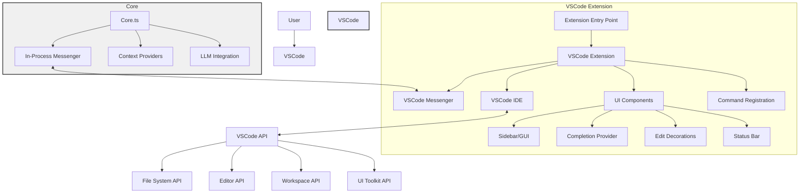
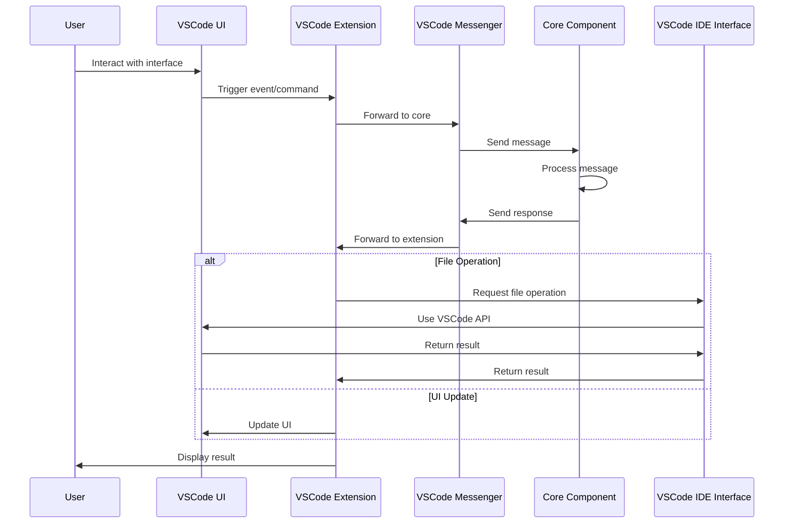

# IDE Integration

**Navigation:**
- [Index](../index.md)
- [Table of Contents](../table-of-contents.md)
- [Architecture Overview](overview.md)
- [Context System](context-system.md)
- [LLM Integration](llm-integration.md)
- [Agent System](agent-system.md)
- **You are here:** IDE Integration
- [MCP System](mcp-system.md)

This document explains how the Continue extension integrates with Integrated Development Environments (IDEs) like Visual Studio Code.

## Overview

The Continue project is designed with a modular architecture that separates the core functionality from IDE-specific implementations. This allows the extension to support multiple IDEs while sharing most of the codebase.

## IDE Integration Architecture

## Architecture

The IDE integration is structured as follows:

1. **Core Functionality**: Platform-independent code in the `core/` directory
2. **IDE-Specific Extensions**: Implementation for specific IDEs in the `extensions/` directory
3. **Interface Layer**: Abstract interfaces that bridge the core and IDE-specific code

## IDE Interface

The Continue extension defines an abstract `IDE` interface that encapsulates all IDE-specific functionality. This interface is implemented by concrete classes for each supported IDE:

- `VsCodeIde` for Visual Studio Code
- Other implementations for other supported IDEs

The `IDE` interface includes methods for:
- File operations
- Editor interactions
- UI notifications
- Workspace management

## VSCode Implementation

### Entry Point

The VSCode extension's entry point is in `extensions/vscode/src/extension.ts`, which:
1. Sets up the extension environment
2. Initializes the core components
3. Registers commands and providers with VSCode

### VsCodeExtension Class

The `VsCodeExtension` class in `extensions/vscode/src/extension/VsCodeExtension.ts` is the main orchestrator of the VSCode integration:
- Creates and manages the core components
- Registers VSCode-specific UI components
- Handles VSCode events and lifecycle

### UI Components

The extension integrates with VSCode's UI through:

1. **WebView Panels**: For chat and interactive interfaces
   - `ContinueGUIWebviewViewProvider` manages the main sidebar interface
   - `ContinueConsoleWebviewViewProvider` provides console output

2. **Editor Decorations**: For inline code suggestions and edits
   - `EditDecorationManager` handles the display of edit suggestions in the editor

3. **Status Bar**: For showing the extension's status
   - The status bar shows the current state of features like autocomplete

4. **Commands**: For user interactions
   - The extension registers various commands for actions like starting a chat or triggering code generation

### Event Handling

The VSCode integration handles various events:
- File changes
- Editor selection changes
- Configuration changes
- Extension lifecycle events

## Messenger System

Communication between the core components and the IDE-specific code happens through a messenger system:

- `VsCodeMessenger` in `extensions/vscode/src/extension/VsCodeMessenger.ts` handles messages between the core and VSCode
- `InProcessMessenger` provides in-process communication for components in the same process
- Protocol definitions in `core/protocol` define the message types

## File and Code Operations

The extension interacts with code through:

1. **File System API**: For reading and writing files
2. **Editor API**: For getting and setting text in the editor
3. **Language Services**: For parsing and understanding code
4. **Workspace API**: For managing workspace-wide operations

## Challenges and Considerations

### Platform Differences

- Different IDEs have different APIs and capabilities
- The abstraction layer must handle these differences while providing a consistent interface

### Performance

- IDE extensions must be lightweight and responsive
- Heavy operations are performed asynchronously to avoid blocking the UI

### User Experience

- The extension must integrate seamlessly with the IDE's workflow
- UI components should follow the IDE's design patterns

## Extensibility

The IDE integration is designed to be extensible:
- New IDEs can be supported by implementing the `IDE` interface
- New features can be added by extending the protocol and implementing the corresponding handlers

Understanding the IDE integration is crucial for evolving the extension into an agent-based system, as the agents will need to interact with the IDE to view and modify code.

---

**Navigation:**
- [Index](../index.md)
- [Table of Contents](../table-of-contents.md)
- [Architecture Overview](overview.md)
- [Context System](context-system.md)
- [LLM Integration](llm-integration.md)
- [Agent System](agent-system.md)
- **You are here:** IDE Integration
- [MCP System](mcp-system.md) 