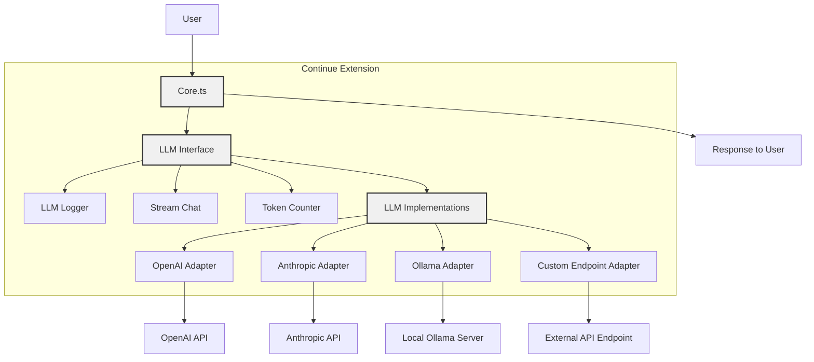
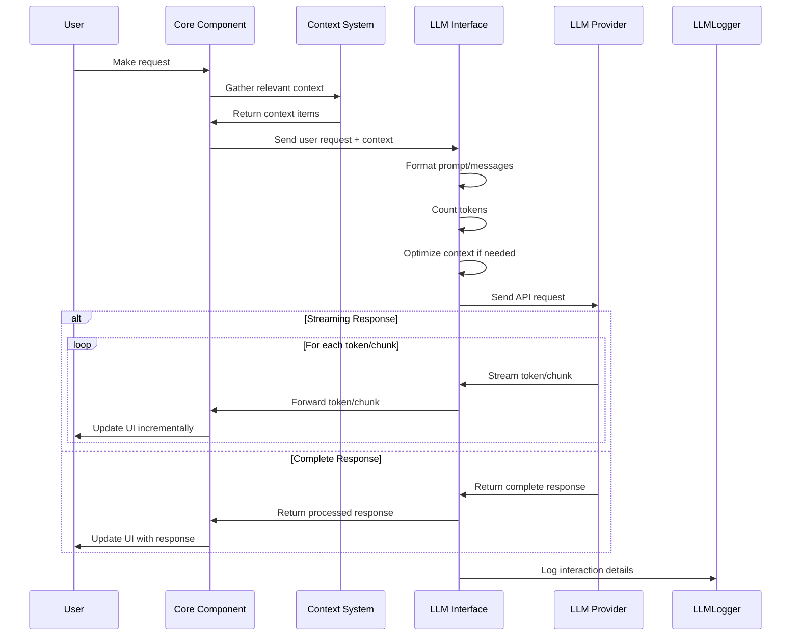

# LLM Integration

**Navigation:**
- [Index](../index.md)
- [Table of Contents](../table-of-contents.md)
- [Architecture Overview](overview.md)
- [Context System](context-system.md)
- **You are here:** LLM Integration
- [Agent System](agent-system.md)
- [IDE Integration](ide-integration.md)
- [MCP System](mcp-system.md)

This document explains how the Continue extension integrates with Large Language Models (LLMs) to provide AI-assisted coding features.

## Overview

The Continue extension is designed to work with various LLMs, providing a flexible architecture that can adapt to different models and providers. The LLM integration is handled primarily through the components in the `core/llm` directory.

## LLM Integration Architecture

## LLM Abstraction

The extension uses an abstraction layer to interact with different LLMs consistently:

- Abstract base classes define the interface for LLM interactions
- Concrete implementations handle the specific details of each LLM provider
- This allows the extension to work with various models without changing the core functionality

## Supported LLM Types

The extension supports multiple types of LLMs:

1. **Local models** (e.g., via Ollama)
2. **API-based models** (e.g., OpenAI, Anthropic)
3. **Custom endpoints** that support standard protocols

## Key Components

### 1. LLM Interface

The core LLM interface provides methods for:
- Chat completion
- Stream chat (for incremental responses)
- Token counting
- Context window management

### 2. LLM Implementations

Specific LLM implementations handle the details of communicating with different providers:
- Authentication
- Request formatting
- Response parsing
- Error handling

### 3. LLM Logger

The `LLMLogger` class tracks and logs LLM interactions for debugging and analytics.

### 4. Stream Chat

The `llmStreamChat` function in `core/llm/streamChat.ts` handles streaming responses from LLMs, which is essential for responsive UI feedback.

## LLM Request/Response Flow

## Integration Points

### 1. Configuration

Users can configure which LLMs to use for different roles:
- Chat: For interactive conversations
- Edit: For code modifications
- Autocomplete: For in-line suggestions
- Embeddings: For semantic search

### 2. Context Preparation

Before sending requests to LLMs, the extension:
- Gathers relevant context from the codebase
- Formats the context and user query appropriately
- Manages token limits to fit within the model's constraints

### 3. Response Processing

After receiving responses from LLMs, the extension:
- Parses and formats the responses
- Handles streaming responses for progressive UI updates
- Extracts code suggestions or other structured information

## Model Context Protocol (MCP)

The extension supports the Model Context Protocol (MCP), which provides a standardized way to communicate with AI models:

- `MCPManagerSingleton` manages connections to MCP servers
- MCP connections can provide a standardized interface to various LLMs
- MCP supports tools and additional context providers

## Challenges and Considerations

### Token Management

- The extension must carefully manage token usage to avoid exceeding LLM context limits
- Token counting utilities help estimate token usage before sending requests
- Dynamic context selection prioritizes the most relevant information

### Error Handling

- LLM requests can fail for various reasons (API limits, connection issues)
- The extension includes robust error handling to provide meaningful feedback to users

### Model Differences

- Different LLMs have varying capabilities and response formats
- The extension normalizes these differences to provide a consistent user experience

Understanding the LLM integration is crucial for evolving the extension into an agent-based system, as agents will interact with LLMs to perform their tasks.

---

**Navigation:**
- [Index](../index.md)
- [Table of Contents](../table-of-contents.md)
- [Architecture Overview](overview.md)
- [Context System](context-system.md)
- **You are here:** LLM Integration
- [Agent System](agent-system.md)
- [IDE Integration](ide-integration.md)
- [MCP System](mcp-system.md) 