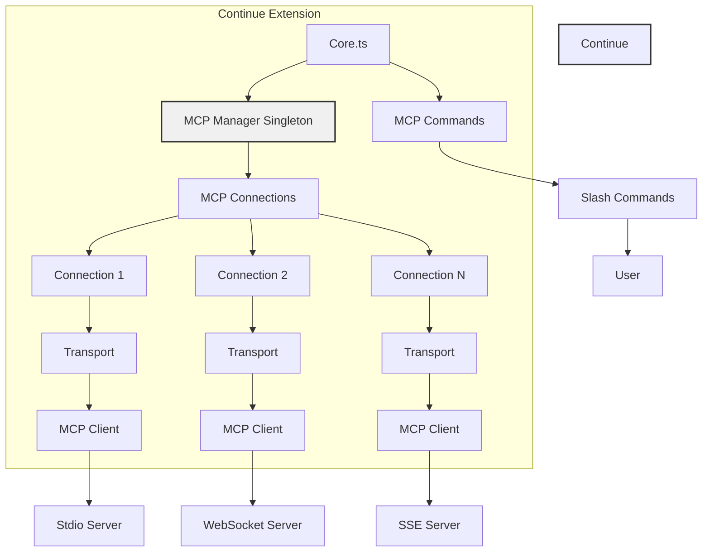
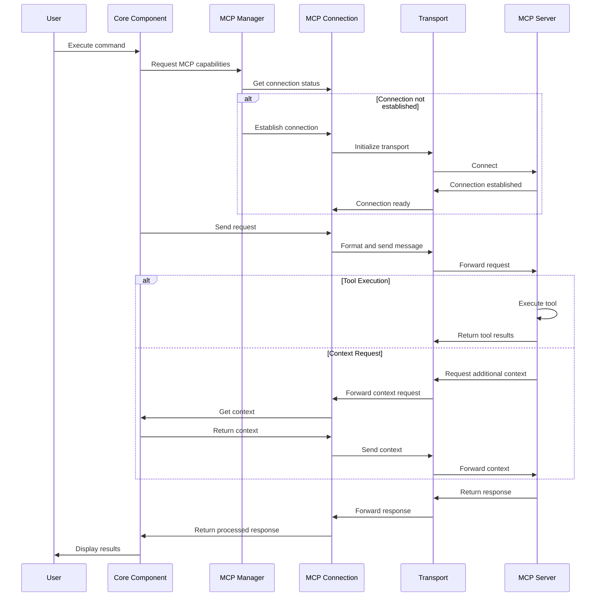

_[← Back to Documentation Navigation](../navigation.md)_

# Model Context Protocol (MCP) System

**Navigation:**
- [Index](../index.md)
- [Table of Contents](../table-of-contents.md)
- [Architecture Overview](overview.md)
- [Context System](context-system.md)
- [LLM Integration](llm-integration.md)
- [Agent System](agent-system.md)
- [IDE Integration](ide-integration.md)
- **You are here:** MCP System

This document explains the Model Context Protocol (MCP) system in the Continue extension and its role in enabling advanced AI capabilities.

## Overview

The Model Context Protocol (MCP) is a standardized way for AI applications to interact with language models, providing a consistent interface across different model providers and enabling rich, tool-augmented interactions.

In the Continue extension, MCP serves as a bridge between the extension and various AI models, allowing for more sophisticated AI capabilities than simple text completion.

## MCP Architecture

## Key Components

### 1. MCPManagerSingleton

The `MCPManagerSingleton` class in `core/context/mcp/index.ts` is the central component of the MCP system:

- Manages connections to MCP servers
- Creates and removes connections as needed
- Refreshes connections to ensure availability
- Provides status information about connected servers

### 2. MCPConnection

Each connection to an MCP server is managed by an `MCPConnection` object, which:

- Handles the connection lifecycle
- Maintains the connection state
- Provides access to the capabilities of the connected server
- Handles errors and reconnection logic

### 3. Transports

MCP supports multiple transport mechanisms for communicating with MCP servers:

- **stdio**: For communicating with local processes
- **websocket**: For web-based communication
- **sse**: For server-sent events

### 4. MCP Commands

The extension implements MCP-specific slash commands in `core/commands/slash/mcp.ts`:

- `constructMcpSlashCommand` creates slash commands that leverage MCP capabilities
- These commands allow users to interact with MCP-enabled models through the Continue interface

## MCP Interaction Flow

## Integration with Continue

### 1. Configuration

MCP servers are configured in the Continue configuration:

- Users can add MCP servers to their configuration
- Each server has a unique ID and connection options
- The configuration determines which MCP servers are available to the extension

### 2. Context Providers

MCP can provide additional context to LLMs through specialized context providers:

- MCP servers can expose context providers that gather relevant information
- These providers are integrated with the Continue context system

### 3. Tools

MCP enables tool use in LLM interactions:

- Tools are functions that the LLM can invoke to perform specific tasks
- MCP provides a standardized way to define and use these tools
- Tools can access IDE functionality, external services, or local utilities

## MCP Capabilities

MCP enhances the Continue extension with several capabilities:

### 1. Standardized Interface

- Provides a consistent way to interact with different LLM providers
- Abstracts away provider-specific details

### 2. Tool Use

- Enables LLMs to use tools to perform actions beyond text generation
- Tools can interact with the user's environment, IDE, or external services

### 3. Structured Interaction

- Supports structured message formats for richer interactions
- Enables multi-turn conversations with context preservation

### 4. Enhanced Context

- Provides standardized ways to include relevant context in LLM requests
- Enables context-aware responses from LLMs

## Relevance to Agent-Based System

The MCP system is particularly relevant to our goal of creating a team of AI agents:

1. **Tool Access**: Agents will need access to tools to perform their tasks effectively
2. **Standardized Communication**: MCP provides a consistent way for agents to interact with models
3. **Rich Context**: Agents need context-aware responses to understand and modify the codebase
4. **Structured Interactions**: Agents benefit from structured communication formats

## Future Extensions

To support our agent-based system, we may need to extend the MCP implementation:

1. **Agent-Specific Tools**: Create tools specifically designed for different agent roles
2. **Inter-Agent Communication**: Enable agents to communicate through MCP
3. **Enhanced Context Sharing**: Improve how context is shared between agents
4. **Agent State Management**: Use MCP to manage and persist agent state

## Challenges and Considerations

### Integration Complexity

- MCP adds another layer of abstraction to the system
- Managing multiple MCP connections can be complex

### Performance Overhead

- Communication through MCP may have performance implications
- Tool execution needs to be efficient to maintain responsiveness

### Compatibility

- Not all LLM providers support MCP
- Different providers may have varying levels of MCP support

Understanding the MCP system is crucial for leveraging its capabilities in our agent-based extension, as it provides many of the building blocks needed for sophisticated agent interactions.

---

**Navigation:**
- [Index](../index.md)
- [Table of Contents](../table-of-contents.md)
- [Architecture Overview](overview.md)
- [Context System](context-system.md)
- [LLM Integration](llm-integration.md)
- [Agent System](agent-system.md)
- [IDE Integration](ide-integration.md)
- **You are here:** MCP System 