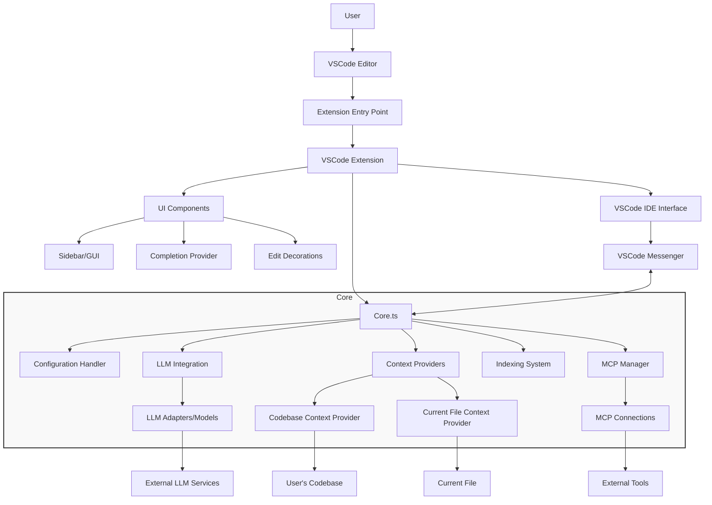

_[← Back to Documentation Navigation](../navigation.md)_

# Continue VSCode Extension Architecture Overview

**Navigation:**

- [Index](../index.md)
- [Table of Contents](../table-of-contents.md)
- **You are here:** Architecture Overview
- [Context System](context-system.md)
- [LLM Integration](llm-integration.md)
- [Agent System](agent-system.md)
- [IDE Integration](ide-integration.md)
- [MCP System](mcp-system.md)

This document provides a high-level overview of the Continue VSCode extension architecture, which will help us understand how to evolve it into an agent-based system.

## Project Structure

The Continue project is organized into several key directories:

- `core/`: Contains the core functionality shared across different IDE extensions
- `extensions/`: Contains IDE-specific implementations (VSCode, JetBrains)
- `packages/`: Shared packages and libraries
- `gui/`: UI components for the extension
- `docs/`: Documentation for the project

## Key Components

### 1. Extension Entry Point

The extension's entry point is in `extensions/vscode/src/extension.ts`, which activates the extension and sets up the necessary infrastructure.

### 2. Core Functionality

The core of the extension is in `core/core.ts`, which orchestrates all the main features:

- Managing configuration
- Handling communications between components
- Processing context for AI models
- Managing LLM interactions

### 3. IDE Integration

The VSCode-specific implementation (`extensions/vscode/src/extension/VsCodeExtension.ts`) integrates the core functionality with VSCode:

- Registers commands, providers, and UI components
- Manages the lifecycle of the extension
- Handles VSCode-specific events and interactions

### 4. Context Providers

A key part of the architecture is the context providers system in `core/context/providers/`:

- `CodebaseContextProvider.ts`: Retrieves relevant code from the codebase
- `CurrentFileContextProvider.ts`: Provides context from the current file

### 5. LLM Integration

The extension interfaces with various LLM models through adapters in `core/llm/llms/`.

### 6. Model Context Protocol (MCP)

The extension supports the Model Context Protocol (MCP) for standardized interactions with AI models:

- `core/context/mcp/index.ts`: Manages MCP connections
- `core/commands/slash/mcp.ts`: Implements MCP slash commands

## Architecture Diagram

## Main Features

The extension provides several AI-assisted features:

1. **Chat**: Interactive chat with AI about code, accessible from the IDE
2. **Autocomplete**: In-line code suggestions as you type
3. **Edit**: Direct code modification through AI suggestions
4. **Agent**: Making substantial changes to the codebase

## Data Flow

1. User interacts with the extension through the VSCode UI
2. The extension gathers context from the codebase
3. Context is sent to the configured LLM along with user input
4. LLM responses are processed and presented to the user
5. User can apply suggestions directly to their code

This architecture is designed to be extensible and modular, making it suitable for our evolution into an agent-based system.

---

**Navigation:**

- [Index](../index.md)
- [Table of Contents](../table-of-contents.md)
- **You are here:** Architecture Overview
- [Context System](context-system.md)
- [LLM Integration](llm-integration.md)
- [Agent System](agent-system.md)
- [IDE Integration](ide-integration.md)
- [MCP System](mcp-system.md)
