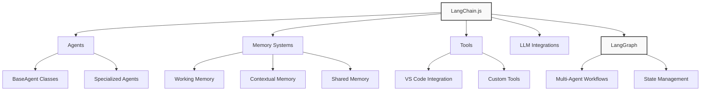
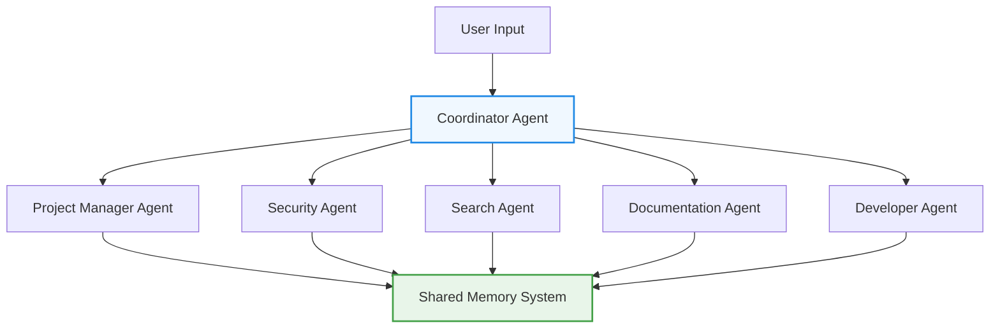

_[← Back to Documentation Navigation](../navigation.md)_

# Agent Frameworks

**Navigation:**

- [Index](../index.md)
- [Table of Contents](../table-of-contents.md)
- [Vector Databases](vector-databases.md)
- **You are here:** Agent Frameworks
- [Embedding Providers](embedding-providers.md)
- [LLM Providers](llm-providers.md)

## Introduction to Agent Frameworks

Agent frameworks provide a structured way to build AI systems that can reason, make decisions, and take actions to accomplish tasks. Unlike simple LLM wrappers, agent frameworks add layers of functionality such as:

1. **Tool/Action Selection**: Ability to choose appropriate tools based on a task
2. **Memory Management**: Retaining context across interactions
3. **Planning and Reflection**: Breaking down complex tasks into steps
4. **State Management**: Tracking the state of an ongoing process
5. **Multi-Agent Coordination**: Orchestrating multiple specialized agents

## LangChain.js in AIgents

LangChain.js serves as the foundation for our agent architecture in AIgents. It's a TypeScript/JavaScript framework for building applications powered by language models, with support for agents, chains, memory, and tools.

### Core LangChain.js Components Used



### LangChain.js Core (v0.3.x)

AIgents uses LangChain.js v0.3.x (as seen in `src/package.json`), which represents a major refactoring of the framework with improved modularity. The main packages we utilize:

- **@langchain/core**: Core abstractions and interfaces
- **langchain**: The main framework that ties everything together
- **@langchain/community**: Community-contributed extensions

### Agent Architecture in AIgents

Our agent system is built on LangChain.js with an architecture inspired by CrewAI's role-based model:



#### Base Agent Implementation

In AIgents, we've extended LangChain.js with our own BaseAgent class (`src/agents/base/index.ts`) that provides:

- Agent identity management
- Message handling and routing
- Tool execution interface
- System prompt configuration
- Message logging

Example of our BaseAgent definition:

```typescript
export abstract class BaseAgent {
  protected id: string;
  protected type: AgentType;
  protected name: string;
  protected systemPrompt: string;
  protected messageLog: AgentMessage[];
  protected description: string;
  protected toolkit: AgentToolkit;

  // Process a message received by this agent
  abstract processMessage(message: AgentMessage): Promise<AgentMessage | null>;

  // Get default system prompt for this agent type
  protected abstract getDefaultSystemPrompt(): string;

  // Handle a message from the user
  abstract handleMessage(message: string): Promise<string>;

  // Execute a tool
  async executeTool(toolName: string, args: any): Promise<any> {
    // Tool execution implementation
  }
}
```

## LangGraph for Workflow Orchestration

LangGraph.js is a new addition to the LangChain ecosystem that enables building complex agent workflows with cycles and stateful execution. It's particularly suited for multi-agent systems like AIgents.

### Key LangGraph Features Used

1. **State Management**: Maintains agent state across interactions
2. **Cycle Support**: Enables LLMs to revisit decisions and refine outputs
3. **Graph-based Workflows**: Models agent interactions as nodes and edges
4. **Controllable Execution**: Provides fine-grained control over execution flow

### AIgents Framework Integration

Our custom framework implementation (`src/agents/framework/index.ts`) integrates LangChain.js and LangGraph concepts with VS Code extension capabilities:

```typescript
export class Framework extends EventEmitter {
  // Core components
  public readonly agentRegistry: AgentRegistry;
  public readonly taskManager: TaskManager;
  public readonly memorySystem: MemorySystem;

  // Framework state
  private initialized: boolean = false;

  // Initialize the framework
  public async initialize(): Promise<void> {
    // Implementation
  }

  // Create a new task
  public async createTask(
    taskConfig: Partial<Types.Task>,
  ): Promise<Types.Task> {
    // Implementation
  }

  // Register an agent with the framework
  public async registerAgent(agent: Types.Agent): Promise<void> {
    // Implementation
  }
}
```

## Memory Systems

LangChain.js provides several memory implementations, which AIgents extends with custom functionality:

### Framework Memory System

Our memory system combines LangChain's memory capabilities with custom implementations:

1. **Working Memory** (`src/agents/framework/working-memory.ts`):

   - Short-term agent memory for ongoing tasks
   - Based on LangChain's BufferMemory

2. **Contextual Memory** (`src/agents/framework/contextual-memory.ts`):

   - Vector store-backed memory for semantic retrieval
   - Integrates with ChromaDB

3. **Shared Memory** (`src/memory/shared.ts`):
   - Cross-agent memory sharing
   - Event-based communication system
   - TTL-based memory management

```typescript
// Example of our SharedMemory implementation
export class SharedMemory extends EventEmitter {
  private static instance: SharedMemory;
  private memory: Map<string, MemoryItem>;

  // Get singleton instance
  public static getInstance(): SharedMemory {
    if (!SharedMemory.instance) {
      SharedMemory.instance = new SharedMemory();
    }
    return SharedMemory.instance;
  }

  // Set a value in shared memory
  public set(
    key: string,
    value: any,
    creator: AgentType,
    metadata: { ttl?: number; tags?: string[] } = {},
  ): string {
    // Implementation
  }

  // Get a value from shared memory
  public get(key: string): any {
    // Implementation
  }

  // Find items by tag
  public findByTag(tag: string): any[] {
    // Implementation
  }
}
```

## Tools Implementation

Tools in LangChain.js enable agents to interact with external systems. AIgents extends this with VS Code-specific tools:

### Tool Categories in AIgents

1. **File System Tools**:

   - Read, write, and navigate code files
   - Search across the codebase

2. **VS Code Integration Tools**:

   - Terminal access
   - Editor manipulation
   - Extension commands

3. **Development Tools**:
   - Code analysis
   - Dependency management
   - Testing

## Best Practices for Using LangChain.js in AIgents

1. **Consistent Agent Structure**:

   - Follow the BaseAgent template for all new agents
   - Use the agent registry for discovery and coordination

2. **Memory Management**:

   - Use SharedMemory for cross-agent communication
   - Implement proper TTL for temporary data
   - Use contextual memory for semantic search

3. **Tool Development**:

   - Create focused, single-purpose tools
   - Include comprehensive descriptions for LLM understanding
   - Implement proper error handling

4. **Graph-based Workflows**:
   - Model complex agent interactions as LangGraph workflows
   - Use state management for persistent operations
   - Implement proper error handling and fallbacks

## Implementation Examples

### Agent Registration

```typescript
// Example of registering an agent with the framework
const developerAgent = new DeveloperAgent();
await framework.registerAgent(developerAgent);
```

### Task Creation and Assignment

```typescript
// Example of creating and assigning a task
const task = await framework.createTask({
  type: "code_development",
  description: "Implement a new feature",
  priority: "high",
});

const agent = framework.findAgentsForTaskType("code_development")[0];
await framework.taskManager.assignTask(task.id, agent.id);
```

### Agent Communication

```typescript
// Example of sending a message between agents
const message = await agent.sendMessage(
  AgentType.DEVELOPER,
  { request: "Analyze this code snippet", code: "..." },
  "request",
);
```

## Advanced LangChain.js Features

### Streaming Responses

AIgents uses LangChain.js streaming capabilities for real-time feedback:

```typescript
const stream = await model.stream("Your prompt here");
for await (const chunk of stream) {
  // Process each chunk as it arrives
}
```

### Custom Prompt Templates

We implement specialized prompts for different agent roles:

```typescript
const promptTemplate = new PromptTemplate({
  template: "You are a {role} assistant. {input}",
  inputVariables: ["role", "input"],
});

const formattedPrompt = await promptTemplate.format({
  role: "developer",
  input: "Help me analyze this code.",
});
```

## Challenges and Solutions

1. **Challenge**: Managing state across multiple agents
   **Solution**: Implemented shared memory system with event-based updates

2. **Challenge**: Handling complex, multi-step workflows
   **Solution**: Adopted LangGraph for graph-based workflow management

3. **Challenge**: Ensuring tools have enough context
   **Solution**: Enhanced tool context with agent memory integration

## Comparison with Alternatives

| Feature                 | LangChain.js          | AutoGen              | Semantic Kernel    |
| ----------------------- | --------------------- | -------------------- | ------------------ |
| **Language Support**    | JavaScript/TypeScript | Python (Limited JS)  | C#, Python, Java   |
| **Agent Architecture**  | Flexible              | Message-based        | Plugin-oriented    |
| **Multi-agent Support** | With LangGraph        | Native               | Limited            |
| **State Management**    | Customizable          | Conversation-based   | Memory & Planners  |
| **VS Code Integration** | Custom implementation | Limited              | Official SDK       |
| **Tool Creation**       | Simple & flexible     | Complex but powerful | Structured plugins |
| **Open Source**         | Apache 2.0            | MIT                  | MIT                |
| **Community Support**   | Large                 | Growing              | Enterprise-backed  |

## References

1. [LangChain.js Documentation](https://js.langchain.com/docs/)
2. [LangGraph Documentation](https://langchain-ai.github.io/langgraphjs/)
3. [LangChain Blog: Multi-Agent Workflows](https://blog.langchain.dev/langgraph-multi-agent-workflows/)
4. [LangGraph.js v0.2 Release](https://blog.langchain.dev/javascript-langgraph-v02-cloud-studio/)
5. [Top 5 LangGraph Agents in Production 2024](https://blog.langchain.dev/top-5-langgraph-agents-in-production-2024/)

## Next Steps

For developers working on AIgents:

1. Explore the `src/agents` directory for concrete implementations
2. Read the agent framework README for setup instructions
3. Check the agent examples to understand best practices
4. Use the framework's TypeScript interfaces for proper tooling

---

**Navigation:**

- [Index](../index.md)
- [Table of Contents](../table-of-contents.md)
- [Vector Databases](vector-databases.md)
- **You are here:** Agent Frameworks
- [Embedding Providers](embedding-providers.md)
- [LLM Providers](llm-providers.md)
