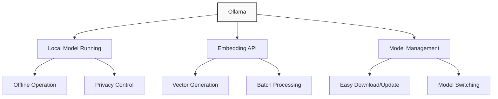

# Embedding Providers

**Navigation:**

- [Index](../index.md)
- [Table of Contents](../table-of-contents.md)
- [Vector Databases](vector-databases.md)
- [Agent Frameworks](agent-frameworks.md)
- **You are here:** Embedding Providers
- [LLM Providers](llm-providers.md)

## Introduction to Embedding Providers

Embedding providers convert text and other data into vector representations (embeddings) that capture semantic meaning in a format that computers can process. These numerical representations enable:

1. **Semantic Search**: Finding content based on meaning rather than exact keyword matches
2. **Similarity Comparisons**: Determining how related different pieces of text are
3. **Clustering**: Grouping similar items together
4. **Retrieval Augmented Generation (RAG)**: Enhancing LLM responses with contextually relevant information

For AIgents, embedding providers are crucial components of our context system, allowing agents to understand code, documentation, and user queries in a more meaningful way.

## Ollama as an Embedding Provider

Ollama is a lightweight, local-first solution for running large language models, including specialized embedding models. In AIgents, we use Ollama to generate embeddings locally without relying on external APIs.

### Key Features



### Ollama Embedding Models

Ollama provides several embedding models optimized for different use cases. The primary models we use in AIgents are:

#### nomic-embed-text

Our default embedding model due to its excellent balance of performance and efficiency:

- **Dimensions**: 768
- **Context Length**: 8192 tokens
- **Size**: ~80MB
- **Architecture**: Based on the Nomic AI embedding model
- **Strengths**: High performance on semantic similarity tasks, supports long contexts
- **Performance**: Comparable to OpenAI's text-embedding-3-small with local execution

#### all-MiniLM

A lightweight alternative when resource efficiency is critical:

- **Dimensions**: 384
- **Context Length**: 512 tokens
- **Size**: ~46MB
- **Architecture**: Based on MiniLM L6
- **Strengths**: Very fast execution, low memory footprint
- **Performance**: Good for short texts, less effective for longer contexts

### Integration in AIgents

The implementation of Ollama in AIgents focuses on providing seamless access to embedding generation while maintaining the project's offline-first philosophy.

#### OllamaEmbeddingsProvider

Our `OllamaEmbeddingsProvider` class implements the `EmbeddingsProvider` interface defined in `src/agents/framework/context-system/embeddings/types.ts`:

```typescript
/**
 * Ollama-based embedding provider for local embedding generation
 */
class OllamaEmbeddingsProvider implements EmbeddingsProvider {
  private apiUrl: string;
  private modelName: string;
  private dimension: number;
  private batchSize: number = 16;

  /**
   * Create a new Ollama embeddings provider
   *
   * @param modelName The Ollama model to use (default: "nomic-embed-text")
   * @param endpoint Custom endpoint URL (default: "http://localhost:11434/api/embeddings")
   */
  constructor(modelName: string = "nomic-embed-text", endpoint?: string) {
    this.modelName = modelName;
    this.apiUrl = endpoint || "http://localhost:11434/api/embeddings";

    // Set dimension based on model
    this.dimension = this.modelName === "nomic-embed-text" ? 768 : 384;
  }

  /**
   * Get the provider name
   */
  getName(): string {
    return `ollama:${this.modelName}`;
  }

  /**
   * Generate embedding for a single text
   */
  async embedOne(text: string): Promise<number[]> {
    try {
      const response = await fetch(this.apiUrl, {
        method: "POST",
        headers: { "Content-Type": "application/json" },
        body: JSON.stringify({
          model: this.modelName,
          prompt: text,
        }),
      });

      if (!response.ok) {
        const error = await response.text();
        throw new Error(`Ollama embedding error: ${error}`);
      }

      const data = await response.json();
      return data.embedding;
    } catch (error) {
      console.error("Error generating embedding:", error);
      throw error;
    }
  }

  /**
   * Generate embeddings for multiple texts
   */
  async embedMany(texts: string[]): Promise<number[][]> {
    // Process in batches if needed
    if (texts.length <= this.batchSize || !this.requiresBatching()) {
      return Promise.all(texts.map((text) => this.embedOne(text)));
    }

    // Process in batches
    const results: number[][] = [];
    for (let i = 0; i < texts.length; i += this.batchSize) {
      const batch = texts.slice(i, i + this.batchSize);
      const batchResults = await Promise.all(
        batch.map((text) => this.embedOne(text)),
      );
      results.push(...batchResults);
    }

    return results;
  }

  /**
   * Get the dimension of the embeddings
   */
  getDimension(): number {
    return this.dimension;
  }

  /**
   * Initialize the provider
   */
  async initialize(): Promise<void> {
    // Test connection and verify model
    try {
      await this.embedOne("test");
    } catch (error) {
      console.error(`Failed to initialize Ollama embeddings: ${error.message}`);
      throw new Error(
        `Failed to connect to Ollama. Is Ollama running with the ${this.modelName} model loaded?`,
      );
    }
  }

  /**
   * Check if the provider requires batching
   */
  requiresBatching(): boolean {
    return true;
  }

  /**
   * Get the optimal batch size for this provider
   */
  getBatchSize(): number {
    return this.batchSize;
  }
}
```

#### Factory Creation

We register the Ollama provider in our embedding provider factory:

```typescript
// In the embedding provider factory
async createProvider(config: EmbeddingsProviderConfig): Promise<EmbeddingsProvider> {
  switch (config.provider.toLowerCase()) {
    case "ollama":
      return new OllamaEmbeddingsProvider(
        config.model || "nomic-embed-text",
        config.endpoint
      );
    // Other providers...
    default:
      throw new Error(`Unknown embeddings provider: ${config.provider}`);
  }
}
```

## Using Ollama Embeddings

### Installation and Setup

1. **Install Ollama**:

   - Download from [https://ollama.com/download](https://ollama.com/download)
   - Follow the installation instructions for your platform

2. **Download Embedding Model**:

   ```bash
   # For the default model
   ollama pull nomic-embed-text

   # For the lightweight alternative
   ollama pull all-minilm
   ```

3. **Verify Installation**:
   ```bash
   # Test that embeddings work
   curl -X POST http://localhost:11434/api/embeddings \
     -d '{"model": "nomic-embed-text", "prompt": "Hello world"}'
   ```

### Configuration in AIgents

To configure Ollama as your embedding provider in AIgents:

```typescript
// Example configuration
const contextSystem = await ContextSystem.create({
  embeddings: {
    provider: "ollama",
    model: "nomic-embed-text",
    // Optional custom endpoint
    endpoint: "http://localhost:11434/api/embeddings",
  },
  vectorStore: {
    type: "chroma",
    // Other vector store configuration...
  },
});
```

### Performance Considerations

When working with Ollama embeddings:

1. **Hardware Requirements**:

   - The embedding models are relatively lightweight compared to LLMs
   - Minimum: 4GB RAM, dual-core CPU
   - Recommended: 8GB RAM, quad-core CPU

2. **Throughput Optimization**:

   - Batch embeddings when processing multiple texts
   - Our implementation uses a default batch size of 16
   - Adjust based on your hardware capabilities

3. **Caching Strategy**:
   - AIgents implements embedding caching to avoid regenerating embeddings
   - Cache is maintained per project to avoid cross-contamination

## Integration with Vector Databases

Ollama embeddings integrate seamlessly with vector databases, particularly ChromaDB as used in AIgents:

```typescript
// Example: Adding embeddings to ChromaDB using Ollama
async addToVectorStore(text: string, metadata: any): Promise<string> {
  // Generate embedding using Ollama
  const embedding = await this.embeddingsProvider.embedOne(text);

  // Store in ChromaDB
  return await this.vectorStore.addVector(embedding, text, metadata);
}
```

This integration enables:

- Semantic search across project code and documentation
- Similarity-based retrieval for context-aware assistance
- Document clustering for knowledge organization

## Comparison with Alternatives

| Feature                   | Ollama (nomic-embed-text) | OpenAI (text-embedding-3-small) | SentenceTransformers | Llama Embeddings    |
| ------------------------- | ------------------------- | ------------------------------- | -------------------- | ------------------- |
| **Offline Operation**     | ✅ Full                   | ❌ Requires API                 | ✅ Full              | ✅ With Ollama      |
| **Dimensions**            | 768                       | 1536                            | 384-768 (varies)     | 4096                |
| **Context Length**        | 8192 tokens               | 8191 tokens                     | ~512 tokens          | 4096 tokens         |
| **Speed**                 | Fast                      | Fast (API latency)              | Very Fast            | Moderate            |
| **Quality**               | High                      | Very High                       | Good                 | High                |
| **Privacy**               | ✅ Local processing       | ❌ Data sent to API             | ✅ Local processing  | ✅ Local processing |
| **Resource Requirements** | Moderate                  | Low (client-side)               | Low                  | High                |
| **Integration Ease**      | Simple API                | Simple API                      | Code integration     | Through Ollama      |
| **Cost**                  | Free                      | Pay-per-use                     | Free                 | Free                |

## Best Practices

When working with Ollama embeddings in AIgents:

1. **Model Selection**:

   - Use `nomic-embed-text` for most use cases (best quality)
   - Use `all-minilm` when memory is constrained or for very short texts

2. **Error Handling**:

   - Implement fallback logic in case Ollama is not running
   - Cache previously generated embeddings to handle offline scenarios

3. **Versioning**:

   - Document the embedding model used in metadata
   - Consider re-embedding when upgrading to newer models

4. **Performance**:
   - Pre-embed frequently accessed content
   - Use the embedding queue system for background processing

## Troubleshooting

Common issues and solutions when working with Ollama embeddings:

### Connection Errors

If you see errors like `Failed to connect to Ollama`:

1. Verify Ollama is running:

   ```bash
   # Check if Ollama is running
   ps aux | grep ollama

   # Start Ollama if needed
   ollama serve
   ```

2. Check if the model is downloaded:

   ```bash
   # List available models
   ollama list

   # Pull the model if needed
   ollama pull nomic-embed-text
   ```

### Performance Issues

If embedding generation is slow:

1. Check system resources:

   ```bash
   # Monitor CPU and memory usage
   top -o cpu
   ```

2. Adjust batch sizes in the embedding queue configuration
3. Consider switching to a lighter model like `all-minilm`

## References

1. [Ollama Official Documentation](https://ollama.com/docs)
2. [Ollama API Reference](https://github.com/ollama/ollama/blob/main/docs/api.md)
3. [Ollama Embedding Models Blog Post](https://ollama.com/blog/embedding-models)
4. [Nomic Embed Documentation](https://blog.nomic.ai/posts/nomic-embed-text-v1)
5. [ChromaDB Cookbook: Ollama Integration](https://cookbook.chromadb.dev/integrations/ollama/embeddings/)

---

**Navigation:**

- [Index](../index.md)
- [Table of Contents](../table-of-contents.md)
- [Vector Databases](vector-databases.md)
- [Agent Frameworks](agent-frameworks.md)
- **You are here:** Embedding Providers
- [LLM Providers](llm-providers.md)
