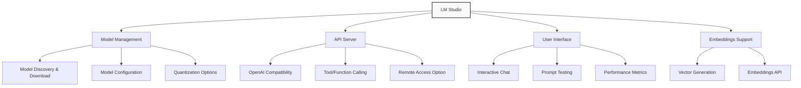

# LLM Providers

**Navigation:**

- [Index](../index.md)
- [Table of Contents](../table-of-contents.md)
- [Vector Databases](vector-databases.md)
- [Agent Frameworks](agent-frameworks.md)
- [Embedding Providers](embedding-providers.md)
- **You are here:** LLM Providers

## Introduction to LLM Providers

LLM (Large Language Model) providers are services or applications that make language models accessible for use in applications. These providers can be:

1. **Cloud-based**: External APIs like OpenAI, Anthropic, and Google serving models from their datacenters
2. **Local**: Software running on the user's machine that serves models from local hardware
3. **Hybrid**: Systems that can switch between local and cloud models based on requirements

For AIgents, we prioritize local LLM providers to ensure privacy, offline functionality, and lower operating costs. This approach aligns with our design philosophy of putting users in control of their AI tools.

## LM Studio as an LLM Provider

LM Studio is a desktop application for running large language models locally. It provides a user-friendly interface for discovering, downloading, and running various open-source models with an OpenAI-compatible API.

### Key Capabilities



### Architecture Integration

In AIgents, we integrate with LM Studio through its OpenAI-compatible API. Our implementation extends the base OpenAI adapter class to connect with LM Studio's local server:

```typescript
// Located in core/llm/llms/LMStudio.ts
class LMStudio extends OpenAI {
  static providerName = "lmstudio";
  static defaultOptions: Partial<LLMOptions> = {
    apiBase: "http://localhost:1234/v1/",
  };
}
```

This simple extension allows us to leverage all the functionality of our OpenAI adapter while connecting to LM Studio's local server instead of the OpenAI cloud API.

### Integration Benefits

1. **OpenAI API Compatibility**: Uses the same interface as OpenAI, simplifying integration
2. **Local Processing**: All requests are processed locally without data leaving the machine
3. **Model Flexibility**: Users can choose from thousands of open-source models
4. **User-friendly Interface**: Visual tools for model management and performance tuning
5. **Dual Purpose**: Supports both chat completions and embeddings generation

## Installation and Setup

### Installing LM Studio

1. **Download LM Studio**:

   - Visit [lmstudio.ai](https://lmstudio.ai/) and download the appropriate version for your OS
   - Available for Windows, macOS, and Linux

2. **Install and Launch**:

   - Follow the installation steps for your operating system
   - Launch LM Studio after installation

3. **Download Models**:
   - Use the 'Discover' tab to find models
   - Recommended starting models:
     - DeepSeek Coder 2 (for code tasks)
     - Llama 3.1 (for general use)
     - Gemma 2 (lightweight option)

### Starting the API Server

1. **Access the Server Interface**:

   - Click the server icon in the left sidebar (looks like `<->`)
   - This opens the "Local Inference Server" view

2. **Configure the Server**:

   - Select your model from the dropdown
   - Configure parameters such as:
     - Context length
     - Temperature
     - Top-P
     - Request timeout

3. **Start the Server**:

   - Click "Start Server"
   - Default server address is `http://localhost:1234`
   - The status will change to "Running" when ready

4. **Testing the Server** (optional):
   - Use the "Test" tab in the server interface
   - Send a test message to verify functionality
   - Ensure responses are generated correctly

## AIgents Integration

In AIgents, we integrate LM Studio through our LLM abstraction layer:

```typescript
// Example configuration
const options: LLMOptions = {
  provider: "lmstudio",
  model: "deepseek-coder-v2",
  apiBase: "http://localhost:1234/v1/", // Default LM Studio endpoint
};

// Creating the LLM instance
const llm = new LMStudio(options);

// Using the LLM for completions
const response = await llm.complete(
  "Write a function to calculate Fibonacci numbers",
  {
    temperature: 0.3,
    maxTokens: 1000,
  },
);
```

### LM Studio for Embeddings

LM Studio also supports generating embeddings, which we use for semantic search:

```typescript
// Example embeddings configuration
const embeddingsProvider = {
  provider: "lmstudio",
  model: "nomic-ai/nomic-embed-text-v1.5-GGUF",
};

// Create embeddings
const embedding = await embeddingsProvider.embedOne(
  "This is text to be converted to a vector",
);
```

## Model Selection and Configuration

### Recommended Models for AIgents

| Task                  | Recommended Model          | Parameters | Quantization | Notes                            |
| --------------------- | -------------------------- | ---------- | ------------ | -------------------------------- |
| **Code Generation**   | DeepSeek Coder 2 (16B/33B) | 16B/33B    | Q5_K_M       | Best for coding tasks            |
| **General Assistant** | Llama 3.1 (8B)             | 8B         | Q4_K_M       | Good balance of size/performance |
| **Fast Responses**    | Gemma 2 (2B)               | 2B         | Q4_0         | Lightweight for weaker hardware  |
| **Embeddings**        | Nomic Embed Text v1.5      | ~1B        | GGUF         | Optimized for embeddings         |

### Parameter Configuration

When configuring models in LM Studio for use with AIgents, consider these parameters:

1. **Context Length**:

   - Set to maximum available for your model (typically 8K-32K)
   - Longer contexts enable processing more code but use more memory

2. **Temperature**:

   - For code generation: 0.1-0.3 (more deterministic)
   - For creative tasks: 0.7-0.9 (more creative)
   - AIgents sets this programmatically but server defaults matter

3. **Top-P**:

   - Recommended: 0.8-0.95
   - Lower values (0.5-0.7) for more focused outputs

4. **Sampling Method**:

   - Recommended: mirostat (adaptive)
   - Alternative: top_p for consistent performance

5. **Threads**:
   - Set based on your CPU (typically 4-8 for most systems)
   - Higher thread count improves throughput but may compete with other applications

## Performance Tuning

### Hardware Considerations

1. **CPU Requirements**:

   - Minimum: 4-core CPU (Intel i5/AMD Ryzen 5 or better)
   - Recommended: 8+ cores for larger models
   - AVX2 instructions significantly improve performance

2. **RAM Requirements**:

   - 8GB: Sufficient for 7B models with 4-bit quantization
   - 16GB: Recommended for everyday use with 7B-13B models
   - 32GB+: Required for larger models (33B+) or long contexts

3. **GPU Acceleration**:
   - NVIDIA GPUs: Enable CUDA for 2-4x performance improvement
   - AMD GPUs: Enable ROCm where supported
   - Apple Silicon: Metal acceleration is automatic

### Optimization Techniques

1. **Quantization Selection**:

   - Q4_K_M: Good balance of quality and memory usage
   - Q5_K_M: Better quality, ~25% more memory usage
   - Q8_0: Best quality, significantly higher memory usage

2. **Context Management**:

   - Limit context to necessary information
   - Implement sliding context windows for long-running sessions

3. **Batch Processing**:

   - Group similar tasks for better throughput
   - Use worker pools for parallel processing

4. **Memory Management**:
   - Close other applications when running large models
   - Monitor system memory usage and adjust models accordingly
   - Consider swap space optimization on constrained systems

## Advanced Features

### Remote Server Configuration

For multi-machine setups, LM Studio can be configured to accept remote connections:

1. **Enable Remote Access**:

   - In LM Studio server settings, check "Allow Remote Connections"
   - Note the security implications of exposing the API

2. **Configure AIgents to use Remote Server**:

   ```typescript
   const options: LLMOptions = {
     provider: "lmstudio",
     model: "your-model-name",
     apiBase: "http://remote-machine-ip:1234/v1/",
   };
   ```

3. **Security Considerations**:
   - Consider using API keys (if supported in your LM Studio version)
   - Use firewall rules to restrict access
   - Consider setting up a reverse proxy with authentication

### Tool/Function Calling

LM Studio supports the OpenAI function calling API which AIgents uses for agent tools:

```typescript
// Example tool definition
const tools = [
  {
    type: "function",
    function: {
      name: "search_codebase",
      description: "Search the codebase for specific patterns or terms",
      parameters: {
        type: "object",
        properties: {
          query: {
            type: "string",
            description: "The search term",
          },
          file_type: {
            type: "string",
            description: "Optional file type to filter by",
          },
        },
        required: ["query"],
      },
    },
  },
];

// Using tools with LM Studio
const response = await llm.chat(messages, {
  tools,
  toolChoice: "auto",
});
```

Note: Tool support varies by model. Models like DeepSeek Coder, Llama 3.1, and some Mistral variants have the best tool calling capabilities.

## Troubleshooting Common Issues

### Connection Problems

If AIgents cannot connect to LM Studio:

1. **Verify Server Status**:

   - Check that LM Studio shows "Running" in the server tab
   - Verify the port (default: 1234) is not in use by another application

2. **Check Network Configuration**:

   - For local use: Ensure `localhost` resolves correctly
   - For remote use: Check firewall settings and network connectivity

3. **API Compatibility**:
   - Some newer OpenAI API features may not be supported
   - Check LM Studio's supported API version in the server information

### Performance Issues

If responses are slow or model performance degrades:

1. **Memory Pressure**:

   - Check system memory usage (Task Manager/Activity Monitor)
   - Consider using a smaller model or higher quantization level

2. **Context Length**:

   - Long conversations may fill the context window
   - Implement conversation summarization or context management

3. **CPU Limitations**:
   - Reduce thread count if CPU is hitting 100%
   - Consider enabling GPU acceleration if available

### Invalid Responses

If responses appear corrupted or incomplete:

1. **Restart the Server**:

   - Sometimes the LM Studio server needs a restart
   - Click "Stop Server" then "Start Server"

2. **Update LM Studio**:

   - Check for updates at [lmstudio.ai](https://lmstudio.ai)
   - New versions often fix API compatibility issues

3. **Check Model Compatibility**:
   - Not all models support all features (e.g., tool calling)
   - Test with a known-good model like Llama 3.1

## Comparison with Alternatives

| Feature                   | LM Studio                   | Ollama                 | LlamaFile           | Cloud API (OpenAI)      |
| ------------------------- | --------------------------- | ---------------------- | ------------------- | ----------------------- |
| **User Interface**        | Full GUI                    | Command line           | Minimal/None        | Web interface           |
| **Setup Complexity**      | Low (installer)             | Low (installer)        | Low (single binary) | Very low (API keys)     |
| **Model Management**      | Built-in discovery/download | Command line pull      | Manual download     | Managed by provider     |
| **API Compatibility**     | OpenAI-compatible           | OpenAI-compatible      | OpenAI-compatible   | Native API              |
| **Configuration Options** | Many, with GUI              | Many, via command line | Limited             | Fixed per model         |
| **Runtime Performance**   | Excellent                   | Excellent              | Good                | Excellent (cloud-based) |
| **Tool/Function Calling** | Supported                   | Supported              | Limited support     | Full support            |
| **Resource Usage**        | Moderate                    | Low-moderate           | Low                 | Minimal (client-side)   |
| **Remote Access**         | Built-in                    | Built-in               | Requires setup      | Native                  |
| **Price**                 | Free                        | Free                   | Free                | Pay-per-token           |
| **Updates**               | Regular                     | Regular                | Infrequent          | Continuous              |

## References

1. [LM Studio Official Website](https://lmstudio.ai/)
2. [LM Studio API Documentation](https://lmstudio.ai/docs/app/api)
3. [LM Studio TypeScript SDK](https://lmstudio.ai/docs/typescript)
4. [OpenAI API Compatibility Guide](https://platform.openai.com/docs/api-reference)
5. [GGUF Model Format Documentation](https://github.com/ggerganov/ggml/blob/master/docs/gguf.md)

---

**Navigation:**

- [Index](../index.md)
- [Table of Contents](../table-of-contents.md)
- [Vector Databases](vector-databases.md)
- [Agent Frameworks](agent-frameworks.md)
- [Embedding Providers](embedding-providers.md)
- **You are here:** LLM Providers
