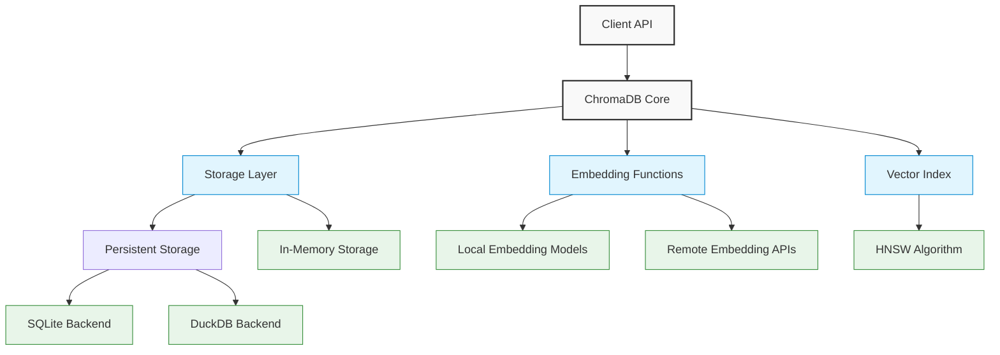

# Vector Databases

**Navigation:**

- [Index](../index.md)
- [Table of Contents](../table-of-contents.md)
- **Technology Documentation:**
  - **You are here:** Vector Databases
  - [Agent Frameworks](agent-frameworks.md)
  - [Embedding Providers](embedding-providers.md)
  - [LLM Providers](llm-providers.md)
- **Architecture Documentation:**
  - [Architecture Overview](../architecture/overview.md)
  - [Context System](../architecture/context-system.md)
  - [LLM Integration](../architecture/llm-integration.md)
  - [Agent System](../architecture/agent-system.md)
  - [IDE Integration](../architecture/ide-integration.md)
  - [MCP System](../architecture/mcp-system.md)

## Introduction to Vector Databases

Vector databases are specialized database systems designed to store, manage, and query vector embeddings—numerical representations of data that capture semantic meaning. In the context of AI applications, vector databases enable semantic search, recommendation systems, and other similarity-based queries.

Key characteristics that distinguish vector databases:

1. **Similarity search**: Finding vectors similar to a query vector using distance metrics
2. **Vector indexing**: Efficient structures for fast approximate nearest neighbor search
3. **Metadata filtering**: Combining vector similarity with structured metadata filters
4. **Scalability**: Handling millions to billions of vectors while maintaining performance

## ChromaDB: An Overview

ChromaDB is our primary vector database for the AIgents project, chosen for its simplicity, effective local operation, and lightweight footprint.

### Core Concepts

- **Collections**: Containers for embeddings, similar to tables in traditional databases
- **Documents**: Text or other data converted to embeddings
- **Embeddings**: Vector representations of documents (can be generated within ChromaDB or externally)
- **Metadata**: Structured data associated with documents for filtering and organization
- **IDs**: Unique identifiers for each item in a collection

### Architecture

ChromaDB offers a flexible, modular architecture with several important components:



### Local Storage Mechanism

ChromaDB provides two primary ways to store data locally:

#### 1. In-Memory Storage (Default Client)

The default `Client` stores all data in memory:

```typescript
import { ChromaClient } from "chromadb";
const client = new ChromaClient();
```

- **Pros**: Fast, no setup required
- **Cons**: Data is lost when the application restarts, limited by available RAM

#### 2. Persistent Storage (PersistentClient)

The `PersistentClient` writes to disk for permanent storage:

```typescript
import { ChromaClient } from "chromadb";
const client = new ChromaClient({
  path: "http://localhost:8000", // Local server path
});

// Or when using the Python API:
// client = chromadb.PersistentClient(path="./chromadb")
```

##### Storage Directory Structure

```
chroma_db/
├── chroma.sqlite3       # SQLite database with metadata
├── index/               # Vector indices
│   └── <collection_id>/ # Index for each collection
└── embeddings/          # Raw embedding data files
```

##### Storage Backends

ChromaDB supports multiple storage backends:

1. **SQLite** (Default):

   - Stores metadata, document content, and embeddings
   - Good for smaller datasets (up to millions of vectors)
   - Simple file-based storage

2. **DuckDB**:
   - Better performance for larger datasets
   - More efficient querying capabilities
   - Still maintains file-based simplicity

### Project Isolation in ChromaDB

For AIgents, we need to ensure isolation between different VS Code projects. ChromaDB offers several approaches:

#### 1. Collection-Based Isolation

Each VS Code project gets its own collection with a unique name derived from the project ID:

```typescript
// Create a project-specific collection
const collection = await client.getOrCreateCollection({
  name: `aigents-${projectId}`,
  metadata: {
    projectId: projectId,
    description: "AIgents vector embeddings for project",
  },
});
```

This approach provides logical separation while maintaining a single ChromaDB instance.

#### 2. Path-Based Isolation

For stronger isolation, each project can have its own ChromaDB instance with a unique path:

```typescript
const storageBasePath = path.join(extensionStoragePath, "vector-db");
const projectPath = path.join(
  storageBasePath,
  hashProjectPath(workspace.uri.fsPath),
);

// Create client with project-specific path
const client = new ChromaClient({
  path: `http://localhost:8000?directory=${projectPath}`,
});
```

#### 3. Docker-Based Isolation

For the strongest isolation, run ChromaDB in Docker with volume mapping per project:

```yaml
# docker-compose.yml for a specific project
version: "3"
services:
  chroma:
    image: chromadb/chroma
    volumes:
      - ./data/chromadb-project-1:/chroma/data
    ports:
      - "8000:8000"
```

### Performance Characteristics

ChromaDB performance depends on several factors:

1. **Collection Size**: Performance typically scales well up to ~1M embeddings with default settings
2. **Embedding Dimensions**: Higher dimensions (>1536) may impact performance
3. **Storage Backend**: SQLite (default) vs DuckDB (better for larger datasets)
4. **Index Type**: HNSW parameters affect query speed and accuracy
5. **Hardware**: SSD vs HDD storage, available RAM, CPU cores

For AIgents, the default SQLite backend is suitable for most project sizes, as code repositories typically generate thousands to tens of thousands of embeddings, well within ChromaDB's performant range.

### Comparison with Alternatives

| Feature                    | ChromaDB                  | Qdrant             | Weaviate                | Pinecone           | Milvus             |
| -------------------------- | ------------------------- | ------------------ | ----------------------- | ------------------ | ------------------ |
| **Local Operation**        | ✅ Built-in               | ✅ Self-hosted     | ✅ Self-hosted          | ❌ Cloud-only      | ✅ Self-hosted     |
| **Embedded Mode**          | ✅ In-memory & persistent | ✅ Embedded mode   | ❌ Requires Docker      | ❌ No              | ✅ Lite version    |
| **Setup Complexity**       | Low                       | Medium             | High                    | Low (cloud)        | High               |
| **TypeScript Support**     | ✅ Official client        | ✅ Official client | ✅ Official client      | ✅ Official client | ✅ Official client |
| **Storage Mechanism**      | SQLite/DuckDB             | Custom ACID        | Filesystem/Object store | Cloud              | Multiple backends  |
| **Resource Usage**         | Low                       | Medium             | Medium-High             | N/A (cloud)        | High               |
| **Project Isolation**      | Collections               | Collections        | Classes                 | Indexes            | Collections        |
| **Filtering Capabilities** | Basic                     | Advanced           | GraphQL + CRUD          | Basic              | Advanced           |
| **License**                | Apache 2.0                | Apache 2.0         | BSD-3                   | Proprietary        | LPGLv3/Proprietary |

For AIgents' requirements (offline operation, easy setup, per-project isolation), ChromaDB offers the best balance of simplicity and functionality.

## JavaScript/TypeScript Integration

### Client Setup

```typescript
import { ChromaClient, Collection } from "chromadb";

// Default client (in-memory)
const client = new ChromaClient();

// For HTTP connection to a running ChromaDB server
const persistentClient = new ChromaClient({
  path: "http://localhost:8000",
});
```

### Basic Operations

```typescript
// Create a collection
const collection = await client.createCollection({
  name: "my_collection",
  metadata: { description: "Example collection" }
});

// Add documents with embeddings
await collection.add({
  ids: ["id1", "id2"],
  embeddings: [[0.1, 0.2, ...], [0.3, 0.4, ...]],  // Pre-computed embeddings
  metadatas: [{ source: "file1.ts" }, { source: "file2.ts" }],
  documents: ["document text 1", "document text 2"]
});

// Query similar items
const results = await collection.query({
  queryEmbeddings: [[0.1, 0.3, ...]],
  nResults: 10,
  where: { source: "file1.ts" }  // Metadata filtering
});
```

### Integration with Ollama Embeddings

```typescript
import { ChromaClient } from "chromadb";
import fetch from "node-fetch";

// Custom embedding function using Ollama
async function getEmbeddingFromOllama(text: string): Promise<number[]> {
  const response = await fetch("http://localhost:11434/api/embeddings", {
    method: "POST",
    headers: { "Content-Type": "application/json" },
    body: JSON.stringify({
      model: "nomic-embed-text",
      prompt: text,
    }),
  });

  const data = await response.json();
  return data.embedding;
}

// Use with ChromaDB
async function addToChromaWithOllama(collection, document, id, metadata = {}) {
  const embedding = await getEmbeddingFromOllama(document);

  await collection.add({
    ids: [id],
    embeddings: [embedding],
    metadatas: [metadata],
    documents: [document],
  });
}
```

## AIgents Implementation

For AIgents, we implement ChromaDB integration as follows:

### 1. ChromaVectorStore Adapter

```typescript
// src/agents/framework/context-system/vector-store/chroma-vector-store.ts
import { ChromaClient, Collection } from "chromadb";
import { v4 as uuidv4 } from "uuid";
import {
  Vector,
  VectorMetadata,
  VectorMetadataFilter,
  VectorSearchOptions,
  VectorSearchResult,
  VectorStore,
} from "./types.js";

export class ChromaVectorStore implements VectorStore {
  private client: ChromaClient;
  private collection: Collection;
  private projectId: string;

  constructor(projectId: string, options: { path?: string } = {}) {
    // Connect to local ChromaDB instance
    this.client = new ChromaClient({
      path: options.path || "http://localhost:8000",
    });
    this.projectId = projectId;
  }

  async initialize(): Promise<void> {
    // Create a collection specific to this project
    this.collection = await this.client.getOrCreateCollection({
      name: `aigents-${this.projectId}`,
      metadata: {
        projectId: this.projectId,
        description: "AIgents vector embeddings",
      },
    });
  }

  // Implementation of VectorStore interface methods...
}
```

### 2. Docker Deployment Configuration

```yaml
# docker-compose.yml
version: "3"
services:
  chroma:
    image: chromadb/chroma
    volumes:
      - ./data/chromadb:/chroma/data
    ports:
      - "8000:8000"
    environment:
      - ALLOW_RESET=true
```

### 3. Factory Function

```typescript
// Factory function to create vector store
export async function createVectorStore(
  projectId: string,
  options: {
    inMemory?: boolean;
    path?: string;
  } = {},
): Promise<VectorStore> {
  // Use in-memory store for development
  if (options.inMemory) {
    const memoryStore = new MemoryVectorStore();
    await memoryStore.initialize();
    return memoryStore;
  }

  // Use ChromaDB for persistent storage
  const chromaStore = new ChromaVectorStore(projectId, { path: options.path });
  await chromaStore.initialize();
  return chromaStore;
}
```

## Best Practices

1. **Collection Management**:

   - Create one collection per logical data grouping
   - Use consistent naming conventions for collections
   - Include descriptive metadata with each collection

2. **Embedding Strategy**:

   - Use consistent embedding models for indexing and querying
   - Pre-compute embeddings in batches when possible
   - Consider dimensionality vs. quality trade-offs

3. **Data Organization**:

   - Use metadata for effective filtering
   - Store source references for traceability
   - Include creation timestamps for temporal queries

4. **Query Optimization**:

   - Combine vector search with metadata filters
   - Adjust `n_results` based on recall requirements
   - Use appropriate distance metrics for your embedding space

5. **Resources Management**:
   - Close connections when not in use
   - Monitor disk usage for persistent storage
   - Consider index parameters for memory-constrained environments

## References

- [ChromaDB Official Documentation](https://docs.trychroma.com/)
- [ChromaDB GitHub Repository](https://github.com/chroma-core/chroma)
- [ChromaDB JS Client Documentation](https://docs.trychroma.com/js-client)
- [Vector Database Benchmarks](https://github.com/qdrant/vector-db-benchmark)
- [HNSW Algorithm Paper](https://arxiv.org/abs/1603.09320)

---

**Navigation:**

- [Index](../index.md)
- [Table of Contents](../table-of-contents.md)
- **Technology Documentation:**
  - **You are here:** Vector Databases
  - [Agent Frameworks](agent-frameworks.md)
  - [Embedding Providers](embedding-providers.md)
  - [LLM Providers](llm-providers.md)
- **Architecture Documentation:**
  - [Architecture Overview](../architecture/overview.md)
  - [Context System](../architecture/context-system.md)
  - [LLM Integration](../architecture/llm-integration.md)
  - [Agent System](../architecture/agent-system.md)
  - [IDE Integration](../architecture/ide-integration.md)
  - [MCP System](../architecture/mcp-system.md)
