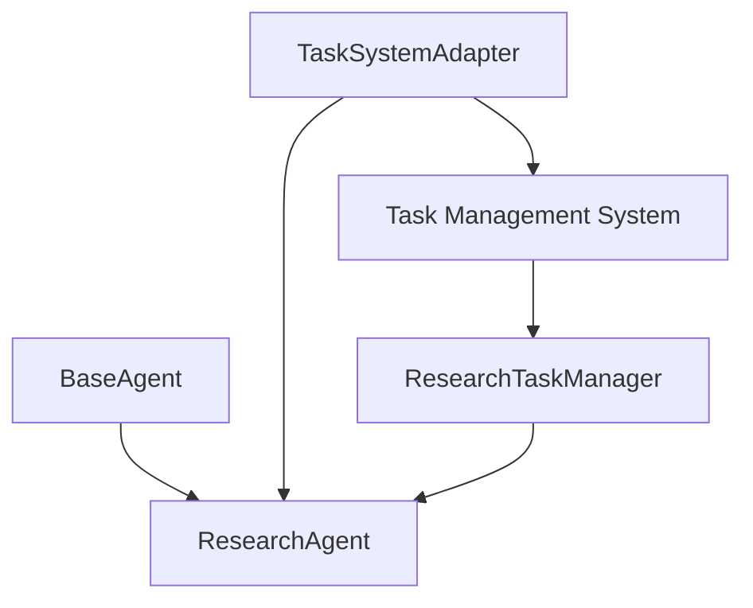

# Agent-Task Integration Architecture

## Overview

This document outlines the architecture for integrating specialized agents with the task management system. The implementation follows a composition-based approach that enhances agents with task management capabilities without modifying the base agent class.

**Date**: 2024-05-17  
**Status**: Implementation in progress  
**Priority**: High

## Core Architecture

The agent-task integration uses a three-layer architecture:

1. **TaskSystemAdapter**: Connects agents with the general task system
2. **Specialized TaskManagers**: Domain-specific task managers for different agent types
3. **Enhanced Agents**: Worker agents augmented with task awareness and context management



### Key Design Principles

1. **Composition over Inheritance**: We use a composition-based approach where agents contain task management capabilities rather than inheriting them.
2. **Single Responsibility**: Each component has a clear, focused responsibility.
3. **Encapsulation**: Implementation details are hidden behind well-defined interfaces.
4. **Extensibility**: The architecture can be easily extended to new agent types.
5. **Loose Coupling**: Components interact through clearly defined interfaces.

## Component Details

### 1. TaskSystemAdapter

The TaskSystemAdapter provides a bridge between agents and the task management system. It offers:

- Context creation and management
- Message and decision storage
- Document and finding management
- Task retrieval and manipulation

**Key Methods**:

- `storeMessage(source, content, metadata)`: Stores a message in the agent's context
- `storeDecision(title, description, metadata)`: Records a decision with metadata
- `storeDocument(title, content, type, metadata)`: Stores a document/finding
- `findOrCreateAgentContext(id, description)`: Creates or retrieves a context
- `getCurrentTask()`: Gets the current active task for the agent

**Implementation**:

```typescript
export interface TaskSystemAdapter {
  storeMessage(
    source: string,
    content: string,
    metadata?: Record<string, any>,
  ): Promise<void>;
  storeDecision(
    title: string,
    description: string,
    metadata?: Record<string, any>,
  ): Promise<void>;
  storeDocument(
    title: string,
    content: string,
    type: string,
    metadata?: Record<string, any>,
  ): Promise<void>;
  findOrCreateAgentContext(id: string, description: string): Promise<string>;
  getCurrentTask(): Promise<Task | null>;
  // ... additional methods
}
```

### 2. Specialized TaskManagers

Each agent type has a specialized TaskManager that handles domain-specific task operations:

- Task creation and initialization
- Workflow stage management
- Domain-specific metadata tracking
- Task relationship management

**Example: ResearchTaskManager**:

```typescript
export class ResearchTaskManager {
  constructor(
    private taskManager: TaskManager,
    private agentId: string,
  ) {}

  async createResearchTask(
    topic: string,
    initialQuery: string,
  ): Promise<string> {
    /* ... */
  }
  async startResearchTask(taskId: string): Promise<void> {
    /* ... */
  }
  async getCurrentTask(): Promise<Task | null> {
    /* ... */
  }
  async transitionResearchStage(
    taskId: string,
    newStage: ResearchWorkflowStage,
  ): Promise<void> {
    /* ... */
  }
  async updateResearchTaskProgress(
    taskId: string,
    progress: string,
  ): Promise<void> {
    /* ... */
  }
  async addResearchFinding(
    taskId: string,
    finding: ResearchFinding,
  ): Promise<void> {
    /* ... */
  }
  // ... additional methods
}
```

### 3. Workflow Stages

Each agent type defines its own workflow stages to represent the progression of tasks:

**Example: ResearchWorkflowStage**:

```typescript
export enum ResearchWorkflowStage {
  PLANNING = "planning",
  GATHERING = "gathering",
  ANALYZING = "analyzing",
  SYNTHESIZING = "synthesizing",
  REPORTING = "reporting",
  COMPLETED = "completed",
}
```

### 4. Helper Functions

Helper functions provide specialized functionality for agent-specific operations:

- Topic extraction
- Stage transition logic
- Coordination decisions
- Context analysis

**Example Helper Functions**:

```typescript
export function extractResearchTopic(message: string): string {
  /* ... */
}
export function determineNextResearchStage(
  task: Task,
  message: string,
): ResearchWorkflowStage | null {
  /* ... */
}
export function shouldReturnToCoordinator(message: string): boolean {
  /* ... */
}
```

### 5. Enhanced Agents

Worker agents are enhanced with task awareness through:

- TaskSystemAdapter composition
- Specialized TaskManager integration
- Stage-aware system prompts
- Context preservation mechanisms

**Example Integration in ResearchAgent**:

```typescript
export class ResearchAgent extends BaseAgent {
  private taskSystemAdapter?: TaskSystemAdapter;
  private researchTaskManager?: ResearchTaskManager;
  private useTaskMemory: boolean;

  constructor(config: ResearchAgentConfig) {
    super(
      config.id,
      AgentType.RESEARCH,
      config.name,
      config.description,
      config.model,
      config.tools || [],
    );

    this.useTaskMemory = config.useTaskMemory || false;

    // Initialize task system if using task memory
    if (this.useTaskMemory) {
      this.initializeTaskSystem();
    }
  }

  private async initializeTaskSystem(): Promise<void> {
    if (this.useTaskMemory) {
      // Create task system adapter
      this.taskSystemAdapter = await createTaskSystemAdapter(this);

      // Initialize research task manager
      this.researchTaskManager = new ResearchTaskManager(
        this.taskManager,
        this.id,
      );
    }
  }

  // Agent implementation with task-aware processing
  public async process(state: {
    messages: BaseMessage[];
  }): Promise<Command | { messages: BaseMessage[] }> {
    // Task-aware message processing
    // ...
  }
}
```

## Workflow Implementation

### Research Agent Workflow

The ResearchAgent implements a structured workflow with six stages:

1. **Planning**: Understanding research objectives and defining approach
2. **Gathering**: Collecting information from various sources
3. **Analyzing**: Evaluating information and identifying patterns
4. **Synthesizing**: Combining findings into cohesive narrative
5. **Reporting**: Creating final research report with citations
6. **Completed**: Research complete, handling follow-up questions

**Stage Transitions**:

- The agent uses `determineNextResearchStage()` to identify when to transition between stages
- Transitions are triggered by user input, agent decisions, or completion criteria
- Each transition updates the task metadata and adapts the agent's system prompt

**System Prompt Adaptation**:

```typescript
private async getUpdatedSystemPrompt(): Promise<string> {
  let prompt = this.systemPrompt;

  // Add task-specific information if available
  if (this.useTaskMemory && this.researchTaskManager) {
    const stagePrompts: Record<string, string> = {
      [ResearchWorkflowStage.PLANNING]: "\n\nYou are in the PLANNING stage...",
      [ResearchWorkflowStage.GATHERING]: "\n\nYou are in the GATHERING stage...",
      // ... other stages
    };

    // Get current stage and add appropriate guidance
    const currentTask = await this.researchTaskManager.getCurrentTask();
    if (currentTask && currentTask.metadata?.stage) {
      const stage = currentTask.metadata.stage as string;
      if (stagePrompts[stage]) {
        prompt += stagePrompts[stage];
      }
    }
  }

  return prompt;
}
```

## Implementation Guidelines

### Adding Task Management to a New Agent Type

1. **Define Workflow Stages**:

   ```typescript
   export enum DeveloperWorkflowStage {
     PLANNING = "planning",
     CODING = "coding",
     TESTING = "testing",
     REFACTORING = "refactoring",
     COMPLETE = "complete",
   }
   ```

2. **Create Specialized TaskManager**:

   ```typescript
   export class DeveloperTaskManager {
     constructor(
       private taskManager: TaskManager,
       private agentId: string,
     ) {}

     async createDevelopmentTask(
       feature: string,
       requirements: string,
     ): Promise<string> {
       /* ... */
     }
     async getCurrentTask(): Promise<Task | null> {
       /* ... */
     }
     async transitionDevelopmentStage(
       taskId: string,
       newStage: DeveloperWorkflowStage,
     ): Promise<void> {
       /* ... */
     }
     // ... additional methods
   }
   ```

3. **Implement Helper Functions**:

   ```typescript
   export function extractFeatureRequest(message: string): string {
     /* ... */
   }
   export function determineNextDevelopmentStage(
     task: Task,
     message: string,
   ): DeveloperWorkflowStage | null {
     /* ... */
   }
   // ... additional helpers
   ```

4. **Enhance the Agent**:

   ```typescript
   export class DeveloperAgent extends BaseAgent {
     private taskSystemAdapter?: TaskSystemAdapter;
     private developerTaskManager?: DeveloperTaskManager;
     private useTaskMemory: boolean;

     constructor(config: DeveloperAgentConfig) {
       super(/* ... */);
       this.useTaskMemory = config.useTaskMemory || false;
       if (this.useTaskMemory) {
         this.initializeTaskSystem();
       }
     }

     private async initializeTaskSystem(): Promise<void> {
       /* ... */
     }

     public async process(state: {
       messages: BaseMessage[];
     }): Promise<Command | { messages: BaseMessage[] }> {
       // Task-aware processing implementation
       // ...
     }

     private async getUpdatedSystemPrompt(): Promise<string> {
       /* ... */
     }
   }
   ```

5. **Register Stage-Specific System Prompts**:
   ```typescript
   const stagePrompts: Record<string, string> = {
     [DeveloperWorkflowStage.PLANNING]:
       "\n\nYou are in the PLANNING stage. Focus on understanding requirements...",
     [DeveloperWorkflowStage.CODING]:
       "\n\nYou are in the CODING stage. Focus on implementing the feature...",
     // ... other stages
   };
   ```

## Architectural Benefits

1. **Flexibility**: Components can be enhanced independently
2. **Reusability**: Common functionality is shared across agent implementations
3. **Maintainability**: Clear separation of concerns makes the codebase easier to understand and extend
4. **Testability**: Components can be tested in isolation
5. **Scalability**: Architecture supports adding new agent types with minimal modifications

## Integration with BaseAgent

This architecture preserves the BaseAgent class's integrity while enhancing agents with task capabilities:

1. **No BaseAgent Modifications**: The BaseAgent class remains unchanged
2. **Composition-Based Integration**: Task capabilities are added through composition
3. **Interface Compatibility**: Enhanced agents maintain full compatibility with the agent interface
4. **Graceful Degradation**: Agents function without task capabilities if not explicitly initialized

## Error Handling

The architecture incorporates robust error handling:

1. **Transaction Management**: Task operations use transactions to ensure consistency
2. **Graceful Degradation**: Agents can function even if task operations fail
3. **Error Logging**: All errors are logged for debugging and analysis
4. **Retry Logic**: Critical operations can be retried on failure

## Testing Strategy

1. **Unit Testing**: Individual components tested in isolation
2. **Integration Testing**: Component interactions verified
3. **End-to-End Testing**: Full agent workflow tested with simulated user interactions
4. **State Transition Testing**: Verify workflow stage transitions work correctly
5. **Error Recovery Testing**: Test system resilience during failures

## Current Status and Next Steps

- [x] Architecture design completed
- [x] TaskSystemAdapter implemented
- [x] ResearchTaskManager implemented
- [x] ResearchAgent integration completed
- [ ] DeveloperAgent integration implementation
- [ ] SecurityAgent integration implementation
- [ ] Comprehensive testing
- [ ] Performance optimization
- [ ] Documentation completion

## Conclusion

The agent-task integration architecture provides a flexible, maintainable approach to enhancing agents with task management capabilities. By using composition rather than inheritance, we maintain the integrity of the BaseAgent class while providing rich task management functionality.

This architecture enables specialized agents to manage workflow stages, track progress, store findings, and adapt behavior based on the current task context. The implementation supports seamless transitions between stages and preserves context across interactions.

Future expansion will include implementing similar task management functionality for the DeveloperAgent and SecurityAgent, creating visualization tools for task status, and comprehensive testing of the integrated system.
